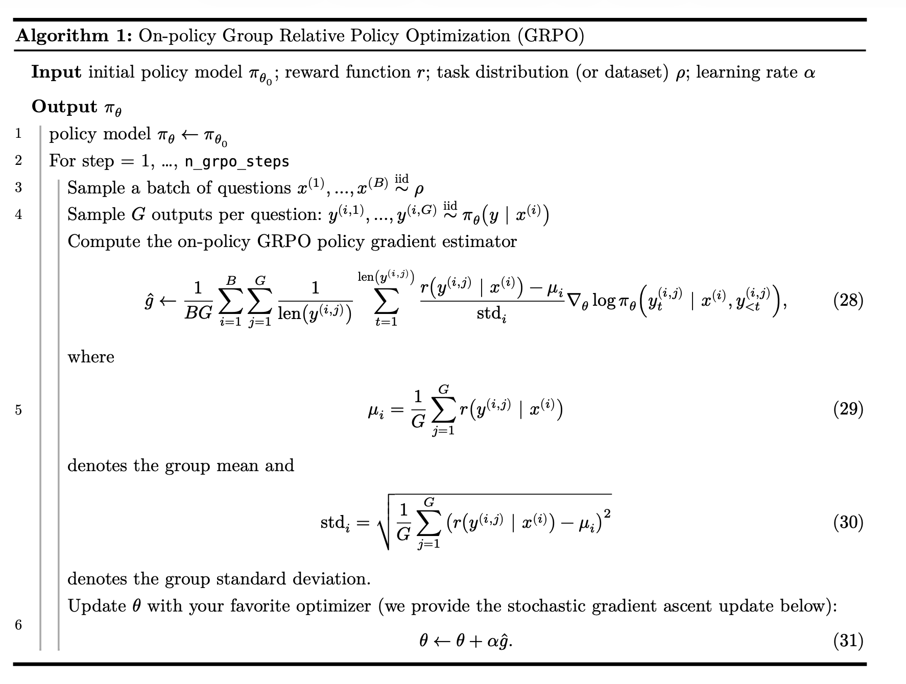

# CS336 Assignment 5：语言模型对齐技术详解

> **课程名称**：Stanford CS336 Spring 2026 — 语言模型基础  
> **作业版本**：Version 26.0.0  
> **核心主题**：提示工程 · GRPO 强化学习 · RL 算法变体 · 离策略 RL · 直接偏好优化（DPO）

---

## 目录

1. [作业概述](#1-作业概述)
2. [引言](#2-引言)
3. [提示工程](#3-提示工程)
4. [组相对策略优化（GRPO）](#4-组相对策略优化grpo)
5. [RL 算法变体](#5-rl-算法变体)
6. [离策略强化学习](#6-离策略强化学习)
7. [尝试你自己的策略梯度估计器](#7-尝试你自己的策略梯度估计器)
8. [直接偏好优化（DPO）](#8-直接偏好优化dpo)
9. [代码实现总结](#9-代码实现总结)
10. [关键公式速查](#10-关键公式速查)

---

## 1. 作业概述

本次作业将通过动手训练语言模型来解决数学推理任务，涵盖后训练技术栈的完整链路。

### 1.1 你将实现的内容

1. **零样本、少样本和思维链提示**（zero-shot, few-shot, chain-of-thought prompting）
2. **GRPO**（Group Relative Policy Optimization）：一种利用外部奖励提升模型性能的强化学习算法
3. **策略梯度估计变体**：探索方差缩减与重要性权重截断策略
4. **离策略 RL**：加速训练，同时探索多种截断方案

### 1.2 你将运行的实验

1. 测量 OLMo-2-0425-1B 在 GSM8K 上的提示性能基线
2. 在 OLMo-2-0425-1B 上运行在策略 GRPO 以提升 GSM8K 性能
3. 运行 RL 算法变体（RFT、Dr. GRPO、MaxRL），探索 RL 中的算法设计选择
4. 运行离策略 GRPO，加速训练并探索各种截断策略

### 1.3 代码结构

所有作业代码和本说明文档可在 GitHub 获取（`github.com/stanford-cs336/assignment5-alignment`）。代码目录结构如下：

1. **`cs336_alignment/`**：你编写作业代码的主目录（除提供的起始代码外，其余内容均需自行实现）
2. **`cs336_alignment/vllm_utils.py`**：启动 vLLM 服务器并生成文本，同时支持同步权重的代码
3. **`cs336_alignment/drgrpo_grader.py`**：对数学问题的模型输出进行评分的代码
4. **`cs336_alignment/prompts/`**：提供的提示文本文件目录
5. **`tests/*.py`**：包含必须通过的 GRPO 测试，以及可选的对齐/安全补充测试

`tests/test_grpo.py` 中的必需测试通过 `tests/adapters.py` 中定义的钩子来调用你的代码。你需要实现相应的适配器将代码连接到测试框架。欢迎编写更多测试或修改测试代码来辅助调试，但最终实现需要通过原始测试。

- **`README.md`**：环境配置说明

### 1.4 提交方式

向 Gradescope 提交以下文件：

- **`writeup.pdf`**：所有书面问题的回答（请使用排版工具如 LaTeX 或 Markdown 生成）
- **`code.zip`**：你编写的所有代码

运行 `test_and_make_submission.sh` 脚本生成 `code.zip` 文件。

---

## 2. 引言

### 2.1 背景：后训练与对齐

在本课程的前四次作业中，我们学习了如何预训练一个基础模型。现在，我们要学习后训练（post-training）：在拥有基础模型之后，如何将它变成能解决下游任务的实用工具？

**后训练的两个核心组成部分**：

**对齐（Alignment）**：预训练由于数据混合和训练目标，使模型获得了广泛的知识和行为模式。但当我们要求模型解决任务时，我们期望它的行为具体且有益——成为一个"有帮助且无害的助手"。将宽泛的基础模型转化为专注的对话模型的过程称为"指令微调"或"对齐"，这部分内容在可选的 Assignment 5 补充中介绍。

**强化学习（Reinforcement Learning）**：预训练的目标是让模型学习广泛的知识基础，而后训练 RL 的目标更加精确——让模型在特定任务上（如解决数学题）达到高准确率。这一更窄的目标与预训练至少有两点不同：(a) 我们没有那么多数据；(b) 我们的训练目标从"覆盖度"（学习广泛的语言基础）转变为"精确度"（产出准确的响应）。这些差异促使我们采用新技术——强化学习（RL）。

**RL 的高层工作方式**：给定一组问题和一个判断响应是否正确的评分函数，RL 在循环中执行以下操作：
1. 从模型中采样响应
2. 用评分函数对这些响应评分
3. 上调正确响应的概率，下调错误响应的概率

在 RL 中，与预训练不同，我们不需要一个模仿的正确响应数据集——对于编程任务，我们不需要一个能解决该任务的正确 Python 程序；对于数学推理任务，我们不需要一个能产出正确答案的推理链的训练集。我们直接让模型推理后评分，在模型准确率上求梯度，让模型通过 RL 自主学习。

**RL 的挑战**：RL 速度慢、不稳定，且实现细节对结果影响极大。本次作业将介绍 LLM RL 并探索它的一些挑战。

此外，RL 的动态特性与采样时使用的提示密切相关——使用思维链推理提示对强基础模型执行 RL，能够带来推理能力的显著提升（如 OpenAI o1、DeepSeek-R1 等）。因此，本次作业除探索核心 RL 算法之外，还将探索链式思考提示与 RL 的交互效果。

### 2.2 模型与数据集

**模型**：本次作业使用 **OLMo-2-0425-1B**，这是一个在 OLMo-mix-1124 和 Dolmino-mix-1124 上预训练（共 4 万亿 token）的基础模型。OLMo-mix-1124 主要由 DCLM-Baseline 数据组成，而 Dolmino-mix-1124 是一个更专注的数据混合，包含约 50% DCLM 和 50% 指令跟随、数学、代码、STEM 论文及 Wiki 数据。

选择这个模型的原因：资源限制下，我们选择了一个小型但高能的模型——它在 4000 倍参数量的 token 数上训练，能够在小规模下展示合理的 RL 效果。需要注意，本课程训练的模型规模较小，本身很难解决数学问题，RL 的效果可能不会转移到其他模型-数据集组合。

**数据集**：使用 **GSM8K**（K. Cobbe et al., 2021），存放于 `data/gsm8k/train.jsonl` 和 `data/gsm8k/test.jsonl`，也可在线访问。这是一个小学数学推理应用题数据集。示例如下：

```json
{
  "question": "Natalia sold clips to 48 of her friends in April, and then she sold half as
many clips in May. How many clips did Natalia sell altogether in April and May?",
  "answer": "Natalia sold 48/2 = <<48/2=24>>24 clips in May.\nNatalia sold 48+24 =
<<48+24=72>>72 clips altogether in April and May.\n#### 72"
}
```

在 RL 训练中，模型将学习为此类数学问题生成推理链，逐步提升其解题能力。

### 2.3 符号约定

本次作业涉及一些数学推导，下表提供了全部符号的对照说明。语言模型和强化学习领域有时对同一对象使用不同术语，表中同时列出。

| 符号 | LM 术语 | RL 术语 | 含义 |
|------|---------|---------|------|
| $\rho$ | prompt 分布或数据集 | — | prompt/问题的分布 |
| $x$ | prompt；问题 | 初始状态 | 从 $\rho$ 采样的一个 prompt/问题 |
| $y$ | response；补全；生成；样本 | rollout；轨迹；动作序列 | 对 prompt $x$ 的一个采样答案 |
| $y_t$ | token | 动作 | $y$ 中第 $t$ 个生成的 token |
| $y_{<t}$ | 前缀 | — | 位置 $t$ 之前的所有 token，即 $y_1, \ldots, y_{t-1}$ |
| $\pi_\theta$ | 模型 | 策略 | 参数为 $\theta$ 的模型，对给定 prompt $x$ 的 response $y$ 赋予概率 $\pi_\theta(y \mid x)$ |
| $\pi_\theta(y_t \mid x, y_{<t})$ | 下一 token 分布 | 时刻 $t$ 的策略 | 给定 prompt 和已生成 token 的条件下，token $y_t$ 的概率 |
| $r(y \mid x)$ | 奖励 | — | 表示采样 response 正确性的标量分数（本次作业中为 0 或 1） |
| $B$ | 每批 prompt 数 | — | 每次推理批次的 prompt 数量 |
| $G$ | 每 prompt 的生成数 | 组大小 | 每个 prompt 采样的 response 数量 |
| $\text{len}(y)$ 或 $L$ | response 长度 | 时间跨度 | 一个 response 中生成的 token 数 |
| $A^{(i,j)}$ | 优势 | — | 经过基线减法和归一化后，分配给 prompt $i$ 的第 $j$ 个 response 的权重 |

---

## 3. 提示工程

我们将基础模型应用于下游任务的第一步是**提示（prompting）**。基础模型在广泛的行为上预训练，提示是引导其行为朝向任务解决模式的轻量级方法。在作业后续部分，我们还会看到提示的选择如何影响 RL 的动态和探索过程。

提示模型最基本的方式是直接给出问题，并从模型的下一 token 分布中采样答案——我们将这种策略称为 `question_only`。我们还将比较 `r1_zero` prompt，它来自 DeepSeek R1-Zero 模型，包含问题和引导模型进行链式思考推理的指令。

### 3.1 使用 vLLM 进行推理

为了从模型生成 response，我们需要一个推理引擎。实现推理引擎超出了本作业的范围，因此我们将使用 **vLLM 推理引擎**（W. Kwon et al., 2023），它实现了多种优化，包括快速 CUDA 核函数、PagedAttention 高效 KV 缓存等。启动 vLLM 服务器并生成文本的代码已提供在 `cs336_alignment/vllm_utils.py` 中，接口如下：

```python
@dataclass
class VLLMCompletion:
    text: str
    token_ids: list[int]
    finish_reason: str | None


@dataclass
class VLLMServer:
    model_id: str
    gpu: int = 0
    seed: int = 0
    gpu_memory_utilization: float = 0.9

    def start(self) -> None: ...

    def generate_completions(
        self,
        prompts: list[str],
        sampling_params: dict,
        batch_size: int | None = None,
    ) -> list[VLLMCompletion]: ...
```

### 3.2 零样本、少样本与思维链提示

**r1_zero 提示（零样本思维链）**

除非另有说明，GSM8K 实验统一使用来自 DeepSeek R1-Zero 模型的以下提示（称为 `r1_zero`），位于 `cs336_alignment/prompts/r1_zero.prompt`：

```text
A conversation between User and Assistant. The User asks a question, and the Assistant solves it. The Assistant first thinks about the reasoning process in the mind and then provides the User with the answer. The reasoning process is enclosed within <think> </think> and the answer is enclosed within <answer> </answer> tags, respectively, i.e., <think> reasoning process here </think> <answer> answer here </answer>.
User: {question}
Assistant: <think>
```

在这个提示中，`{question}` 处填入具体的数学问题（例如 "Natalia sold clips to 48 of her friends in April..."）。模型扮演助手的角色，从已有的 `<think>` 开头开始生成，写完推理过程后闭合 `</think>`，然后在答案标签内给出最终数值答案，如 `<answer> 4x + 10 </answer>`。

使用 `<answer></answer>` 标签的目的是：方便解析模型输出并与标准答案比对，同时可以让 vLLM 在模型输出闭合标签 `</answer>` 时停止生成。

**少样本提示（few-shot）**

少样本提示通过在实际问题前添加几个问答示例，帮助模型更好地理解任务。`r1_zero` 的三样本版本如下（位于 `cs336_alignment/prompts/r1_zero_three_shot_gsm8k.prompt`，示例来自 OLMES 数据集）：

```text
A conversation between User and Assistant. The User asks a question, and the Assistant solves it. The Assistant first thinks about the reasoning process in the mind and then provides the User with the answer. The reasoning process is enclosed within <think> </think> and the answer is enclosed within <answer> </answer> tags, respectively, i.e., <think> reasoning process here </think> <answer> answer here </answer>.
User: {question-1}
Assistant: <think> {reasoning-1} </think> <answer> {answer-1} </answer>
User: {question-2}
Assistant: <think> {reasoning-2} </think> <answer> {answer-2} </answer>
User: {question-3}
Assistant: <think> {reasoning-3} </think> <answer> {answer-3} </answer>
User: {question}
Assistant: <think>
```

少样本提示通过给出几个任务示例来提升模型性能——GSM8K 上 OLMo-2-0425-1B 的官方 benchmark 数字即使用 8-shot 提示。

**question_only 提示（基线）**

最后，作为基线，还有 `question_only` 提示（`cs336_alignment/prompts/question_only.prompt`）：

```text
{question} Please put your final answer within \boxed{{}}.
```

注意：虽然名为 `question_only`，但我们仍然要求最终答案放在 `\boxed{}` 内，以方便评分器解析答案。

### 3.3 评分函数

模型生成 response 后，我们需要判断答案是否正确。数学问题的标准答案可能以多种形式给出（如 `1/2`、`0.5`、`The answer is 0.5` 等），因此需要一个能够解析这些格式的答案解析函数。

本次实验使用一个快速且相当准确的答案解析器（来自 Z. Liu et al., 2025 关于推理 RL 的研究）：

- 对于 `r1_zero` 系列提示：奖励函数实现在 `cs336_alignment.drgrpo_grader.rl_zero_reward_fn`
- 对于 `question_only` 提示：使用 `cs336_alignment.drgrpo_grader.question_only_reward_fn`（解析 `\boxed{}` 内的答案）

这些奖励函数返回**总奖励（total reward）**，以及分别反映格式和准确性的**格式奖励（format reward）**和**答案奖励（answer reward）**：

- **格式奖励**：response 是否符合预期格式（如包含 `<think>` 和 `<answer>` 标签）
- **准确性奖励**：解析出的数值答案是否与标准答案一致

在本次实验中，**不给部分分数**——格式正确但答案错误不得额外奖励，总奖励就等于答案奖励（格式奖励仅用于记录日志）。

### 3.4 实验

**生成超参数**：生成 response 时，使用温度 1.0、top-p 1.0、最大生成长度 512。`r1_zero` 系列提示要求模型以 `</answer>` 字符串结束答案，因此可以指示 vLLM 在模型输出该字符串时停止：

```python
# 基于 Dr. GRPO：在模型完成答案时停止
sampling_params['stop'] = ["</answer>"]
sampling_params['include_stop_str_in_output'] = True
```

注意：**仅对 `r1_zero` 和 `r1_zero_three_shot` 提示使用停止字符串**，`question_only` 提示不使用。

---

> **Problem（`prompting_baselines`）：在 GSM8K 上评测 OLMo-2-0425-1B（5 分）**
>
> **(a)** 编写脚本评测 OLMo-2-0425-1B 在 GSM8K 上使用零样本 `question_only`、零样本 `r1_zero` 以及少样本 `r1_zero_three_shot` 提示的性能。
>
> 运行脚本并观察输出。对每种提示，统计模型生成中有多少落入以下类别：
> - (1) 格式奖励 1 且准确性奖励 1（格式正确且回答正确）
> - (2) 格式奖励 1 且准确性奖励 0（格式正确但回答错误）
> - (3) 格式奖励 0 且准确性奖励 0（格式错误且回答错误）
>
> 观察至少 10 个类别 (2) 的例子，有多少模型输出实际上答案正确但解析失败？类别 (3) 呢？
>
> **交付物**：若干句评论、评测指标，以及若干 prompt 和 response 的示例。
>
> **(b)** 观察模型输出，描述模型在每种提示下的行为特征。例如：仅提供问题是否足以让模型回答？模型是否表现出单纯回答问题以外的其他行为？零样本 `r1_zero` 和少样本 `r1_zero_three_shot` 提示如何影响模型行为？
>
> **交付物**：若干句评论，附上支持性示例。

---

## 4. 组相对策略优化（GRPO）

在用提示测量了模型的基础性能之后，下一步是通过训练来提升这一性能。具体而言，我们要最大化模型的准确率，等价地最大化其期望奖励：

$$
J_\theta = E_{x \sim \rho} E_{y \sim \pi_\theta(\cdot|x)}[r(y \mid x)], \tag{1}
$$

其中 $\rho$ 是 prompt/问题的任务分布，$\pi_\theta$ 是我们的模型，$y$ 是一个采样 response/解答，$r(y \mid x)$ 表示 $y$ 是否是 $x$ 的正确答案（我们也将 $r$ 称为"奖励函数"）。

注意，这个目标与我们课程中一直在研究的预训练目标有本质不同：与交叉熵损失 $E_{x \sim \mathcal{D}}[-\log \pi_\theta(x)]$ 不同（其中样本来自数据集），我们的准确率目标涉及对模型自身输出的期望，因此必须使用强化学习来优化。RL 在速度和稳定性方面都很有挑战性——这次作业大量内容都在探索让 RL 更快更稳定的方法。

RL 的另一个特点是，它涉及从模型采样，因此其动态特性受采样时使用的提示的影响。特别地，有研究发现，当对强基础模型使用链式思考推理提示进行 RL 时，可以带来推理能力的显著提升（OpenAI et al., 2024; DeepSeek-AI et al., 2025）。因此，除核心 RL 算法之外，本作业还将探索语言模型技术（如 CoT 提示）与 RL 的交互。

### 4.1 推导在策略 GRPO

我们将首先探索 RL 的数学基础，逐步推导出 GRPO（Group Relative Policy Optimization）算法。GRPO 是训练语言模型时常用的 RL 算法（Z. Shao et al., 2024）。

#### 4.1.1 将语言模型视为强化学习策略

在传统 RL 中，策略（policy）接受状态 $s_t$ 并输出动作 $a_t$；动作产生奖励 $r_t = r(s_t, a_t)$，并转移到下一个状态 $s_{t+1} \sim \text{next\_state}(s_t, a_t)$。RL 的目标是优化策略以获得高奖励。

一个因果语言模型 $\pi_\theta$（参数为 $\theta$）定义了在当前文本前缀 $y_{<t} = (y_1, \ldots, y_{t-1})$ 条件下对下一个 token $y_t$ 的概率分布。在 RL 的语境下，可以将下一个 token $y_t$ 视为**动作** $a_t$，当前文本前缀 $y_{<t}$ 视为**状态** $s_t$。因此，语言模型是一个**分类随机策略**：

$$
a_t \sim \pi_\theta(\cdot \mid s_t), \quad \pi_\theta(a_t \mid s_t) = [\text{softmax}(f_\theta(s_t))]_{a_t}. \tag{2}
$$

使用策略梯度优化策略时，需要两种基本操作：
1. **从策略采样**：从上述分类分布中采样动作 $a_t$
2. **对动作评分**：计算 $\log \pi_\theta(a_t \mid s_t)$（对数似然）

在 LLM RL 中，$s_t$ 是迄今为止生成的部分解答（prompt + 已生成 token），$a_t$ 是解答中的下一个 token；当模型输出文本终止 token（如 `<|end_of_text|>` 或 `</answer>`）时，一个 episode 结束。

#### 4.1.2 轨迹

在 RL 中，从初始状态 $s_0 \sim \rho$ 出发，从策略 $\pi_\theta$ 采样动作 $a_t$，根据状态转移函数进入下一个状态，重复这一过程。这一系列状态和动作构成一条**（有限时界）轨迹**：

$$
\tau = (s_0, a_0, s_1, a_1, \ldots, s_T, a_T), \tag{3}
$$

其中 $T$ 是轨迹长度（即 $a_T$ 是文本终止 token，或达到最大生成 token 数）。

在我们的设定中，$s_0 \sim \rho$ 是包含数学问题的 prompt $x$（可能附带 CoT 提示或少样本示例）；从这个前缀出发，逐 token 采样，下一个状态 $s_{t+1} = (s_t, a_t)$（旧前缀拼接新 token）。轨迹也称为 **episode** 或 **rollout**，这三个术语可互换使用。

#### 4.1.3 奖励与回报

在 RL 中，标量奖励 $r_t = r(s_t, a_t)$ 衡量在状态 $s_t$ 采取动作 $a_t$ 的即时质量。对于像数学推理这样的验证域 RL，我们在中间推理步骤中观察到零奖励，只在最终动作时收到**验证奖励**：

$$
r_T = r(s_T, a_T) := \begin{cases} 1 & \text{若轨迹 } \tau \text{ 按奖励函数与标准答案匹配} \\ 0 & \text{否则} \end{cases}. \tag{4}
$$

即 $r_T = 1$ 当且仅当最终答案正确，否则为 0。**回报（return）** $R(\tau)$ 聚合轨迹上的奖励，在我们的设定中就等于 $r_T$。

智能体的目标是最大化期望回报：

$$
J_\theta = E_{\tau \sim \pi_\theta}[r(\tau)], \tag{5}
$$

其中 $\tau \sim \pi_\theta$ 表示先从 $\rho$ 采样 $s_0$，再从策略逐步采样动作和状态。在我们的设定中，这意味着先从数据集采样数学问题 $x \sim \rho$，再逐 token 采样直到 response 结束，记为 $y \sim \pi_\theta(y \mid x)$。该目标引出如下优化问题：

$$
\theta^* = \arg\max_\theta J_\theta. \tag{6}
$$

#### 4.1.4 策略梯度

至此，我们已具备学习一种名为**策略梯度（policy gradients）**的 RL 算法所需的符号与定义。在作业的其余部分，我们将沿用语言模型记号 $(x, y)$ 表示 prompt 和 response，而非 RL 记号中的状态 $s_t$ 和动作 $a_t$。

回顾我们要优化的是模型的期望奖励（即准确率）：

$$
J_\theta = E_{x \sim \rho} E_{y \sim \pi_\theta(y|x)}[r(y \mid x)], \tag{7}
$$

其中 $r(y \mid x)$ 表示 response $y$ 对 prompt $x$ 是否正确。我们的方法是对该目标做梯度上升：

$$
\theta_{k+1} = \theta_k + \alpha \nabla_\theta J_{\theta_k}, \tag{8}
$$

但为此需要能从样本中估计梯度 $\nabla_\theta J_{\theta_k}$。将该梯度重写为对样本的期望，会得到一个被称为 **REINFORCE 策略梯度**的表达式（以 REINFORCE 论文 R. J. Williams, 1992 命名）。具体而言，我们可以把梯度改写为：

$$
\nabla_\theta E_{x \sim \rho} E_{y \sim \pi_\theta(y|x)}[r(y \mid x)] = E_{x \sim \rho} E_{y \sim \pi_\theta(y|x)}[r(y \mid x) \nabla_\theta \log \pi_\theta(y \mid x)]. \tag{9}
$$

在走推导之前先注意，这个表达式蕴含了一个直观的算法（即 REINFORCE）：我们可以从数据集采样问题 $x$，从模型采样 response $y$，对这些样本计算 $r(y \mid x) \nabla_\theta \log \pi_\theta(y \mid x)$ 的平均，然后走一步梯度。表达式 $r(y \mid x) \nabla_\theta \log \pi_\theta(y \mid x)$ 的含义是：我们应当上调高奖励 response $y$ 的对数概率。若不断重复这一过程、走多步梯度，就得到了一个基本的强化学习训练循环。

为推导 REINFORCE 策略梯度，可以使用对数导数技巧（回顾 $\log f(x)$ 的导数为 $\frac{f'(x)}{f(x)}$）：

$$
\nabla_\theta \pi_\theta(y \mid x) = \pi_\theta(y \mid x) \nabla_\theta \log \pi_\theta(y \mid x). \tag{10}
$$

直接应用该恒等式即可得到所需结果：

$$
\begin{align}
\nabla_\theta E_{y \sim \pi_\theta(y|x)}[r(y \mid x)] &= \sum_y \nabla_\theta \pi_\theta(y \mid x) r(y \mid x) \tag{11} \\
&= \sum_y \pi_\theta(y \mid x) \nabla_\theta \log \pi_\theta(y \mid x) r(y \mid x) \tag{12} \\
&= E_{y \sim \pi_\theta(y|x)}[r(y \mid x) \nabla_\theta \log \pi_\theta(y \mid x)]. \tag{13}
\end{align}
$$

注意，上述各式中我们略去了对 prompt 的期望 $E_{x \sim \rho}$，因为 $\nabla_\theta$ 与 $E_{x \sim \rho}$ 可以交换次序。

**直观理解**：$\nabla_\theta \log \pi_\theta(y \mid x)$ 恰好是将 response $y$ 视为 ground truth 时的 SFT 梯度——因此 REINFORCE 等价于用奖励加权的 SFT。

**蒙特卡洛估计**：给定一批 prompt $x^{(1)}, \ldots, x^{(B)} \overset{\text{iid}}{\sim} \rho$ 和每个 prompt 的 $G$ 个 response $y^{(i,j)} \overset{\text{iid}}{\sim} \pi_\theta(y \mid x^{(i)})$，策略梯度的样本估计为：

$$
\hat{g} \leftarrow \frac{1}{BG} \sum_{i=1}^{B} \sum_{j=1}^{G} r\big(y^{(i,j)} \mid x^{(i)}\big) \nabla_\theta \log \pi_\theta\big(y^{(i,j)} \mid x^{(i)}\big). \tag{14}
$$

这将高奖励的 response 上调权重。为推导 GRPO，我们将从这个基本策略梯度估计器出发，逐步添加修改。

#### 4.1.5 基线减法与方差缩减

**高方差问题**：基本 REINFORCE 策略梯度估计器的期望是正确的 $\nabla_\theta J_\theta$，但方差很高，导致 RL 不稳定。稳定训练、降低方差的一个工具是**基线（baselines）**。

基线可以相当复杂，但最简单的基线是从奖励中减去一个常数 $b$：

$$
E_{x \sim \rho} E_{y \sim \pi_\theta(y|x)}[(r(y \mid x) - b) \nabla_\theta \log \pi_\theta(y \mid x)]. \tag{15}
$$

例如，若减去 $b = 0.5$、且奖励 $r$ 是二元的（正确为 1、错误为 0），那么用这个估计器意味着：从模型采样 response，上调正确 response 的权重（权重 $+0.5$），下调错误 response 的权重（权重 $-0.5$）。这与我们原始的梯度估计器形成对比——后者把正确 response 上调权重 1、对错误 response 不作处理（权重 0）。

**关键数学性质**：本节最关键的一条数学事实是：只要基线 $b$ 不依赖于动作/response $y$（例如它可以是常数、$x$ 的函数、或策略的函数），从估计器中减去它就不改变其期望：

$$
E_{x \sim \rho} E_{y \sim \pi_\theta(y|x)}[(r(y \mid x) - b) \nabla_\theta \log \pi_\theta(y \mid x)] = E_{x \sim \rho} E_{y \sim \pi_\theta(y|x)}[r(y \mid x) \nabla_\theta \log \pi_\theta(y \mid x)]. \tag{16}
$$

这一事实可由如下恒等式直接得到：

$$
E_{y \sim \pi_\theta(y|x)}[\nabla_\theta \log \pi_\theta(y \mid x)] = \nabla_\theta \underbrace{\sum_y \pi_\theta(y \mid x)}_{=1} = 0, \tag{17}
$$

其中第一步是把前面的对数导数技巧反向应用。

虽然基线保持估计器的期望不变，但它可以增大或减小方差。这里"方差"的含义是：把策略梯度估计器写成样本均值 $\frac{1}{n} \sum_{i=1}^{n} Z_i$，其中每个 $Z_i$ 是某个样本 $(x, y)$ 上的表达式 $(r(y \mid x) - b) \nabla_\theta \log \pi_\theta(y \mid x)$，则估计器的方差为 $\frac{E[Z_i^2] - E[Z_i]^2}{n}$。我们将在下面这道题中探讨基线在何时增大、何时减小方差。

将 $A(x, y) = r(y \mid x) - b(x)$ 称为**优势（advantage）**。

---

> **Problem（`baseline_calcs`）：计算策略梯度估计器的方差（5 分）**
>
> 设 $\pi_\theta$ 在二元动作空间 $\mathcal{A} = \{0, 1\}$ 上定义策略，$\pi_\theta(A=1) = p = \sigma(\theta)$，其中 $\sigma$ 为 sigmoid 函数 $\sigma(\theta) = \frac{1}{1+e^{-\theta}}$。奖励函数对动作 $A = 1$ 给奖励 1，否则为 0，即 $r(A) = \mathbb{1}\{A = 1\}$。
>
> **(a)** 设策略梯度估计器为
>
> $$\frac{1}{n} \sum_{i=1}^{n} r(A_i) \nabla_\theta \log \pi_\theta(A_i) \tag{18}$$
>
> 其中 $A_i \overset{\text{iid}}{\sim} \pi_\theta$。该估计器的方差是多少？
>
> **交付物**：用 $n$ 和 $p$ 表示的表达式，附推导过程。
>
> **(b)** 设带基线的策略梯度估计器为
>
> $$\frac{1}{n} \sum_{i=1}^{n} (r(A_i) - b) \nabla_\theta \log \pi_\theta(A_i) \tag{19}$$
>
> 其中 $A_i \overset{\text{iid}}{\sim} \pi_\theta$。该估计器的方差是多少？
>
> **交付物**：用 $n$、$b$ 和 $p$ 表示的表达式，附推导过程和若干讨论。
>
> **(c)** 将"总体均值"基线 $b = p$ 代入后，方差是多少？将其与无基线的策略梯度估计器对比：它是否总是更低？总是更高？还是有时更高有时更低，取决于 $p$？

---

**GRPO 中的基线**

GRPO 的第一个组件是应用"组均值"基线：

$$
\hat{g} \leftarrow \frac{1}{BG} \sum_{i=1}^{B} \sum_{j=1}^{G} \big(r(y^{(i,j)} \mid x^{(i)}) - \mu_i\big) \nabla_\theta \log \pi_\theta\big(y^{(i,j)} \mid x^{(i)}\big), \tag{20}
$$

其中 $\mu_i = \frac{1}{G} \sum_{j=1}^{G} r(y^{(i,j)} \mid x^{(i)})$ 是模型在 prompt $x^{(i)}$ 上的平均奖励。注意，尽管 $\mu_i$ 依赖于 response $y$，它仍然将期望保持到一个 $\frac{G-1}{G}$ 的缩放因子之内：

$$
\begin{align}
& E_{y^{(1)},\ldots,y^{(G)} \sim \pi_\theta(y|x)}\!\left[\frac{1}{G} \sum_{j=1}^{G} \big(r(y^{(j)} \mid x) - \mu_i\big) \nabla_\theta \log \pi_\theta(y^{(j)} \mid x)\right] \tag{21} \\[6pt]
&= \frac{1}{G} \sum_{j=1}^{G} E_{y^{(2)},\ldots,y^{(G)} \sim \pi_\theta(y|x)}\!\left[E_{y^{(1)} \sim \pi_\theta(y|x)}\!\left[\big(r(y^{(1)} \mid x) - \mu_i\big) \nabla_\theta \log \pi_\theta(y^{(1)} \mid x)\right]\right] \tag{22} \\[6pt]
&= \frac{1}{G} \sum_{j=1}^{G} E_{y^{(1)} \sim \pi_\theta(y|x)}\!\left[\left(r(y^{(1)} \mid x) - \frac{1}{G} r(y^{(1)} \mid x)\right) \nabla_\theta \log \pi_\theta(y^{(1)} \mid x)\right] \tag{23} \\[6pt]
&= \frac{G-1}{G} E_{y \sim \pi_\theta(y|x)}\!\left[r(y \mid x) \nabla_\theta \log \pi_\theta(y \mid x)\right]. \tag{24}
\end{align}
$$

这些经过组均值调整的奖励通常被称为**优势（advantages）**：相比绝对奖励，这一项表示的是该 rollout 相对于平均奖励的"优势"。

#### 4.1.6 优势归一化

GRPO 的下一个修改是在减去组均值之后，再除以**组标准差**：

$$
\hat{g} \leftarrow \frac{1}{BG} \sum_{i=1}^{B} \sum_{j=1}^{G} \frac{r(y^{(i,j)} \mid x^{(i)}) - \mu_i}{\text{std}_i} \nabla_\theta \log \pi_\theta\big(y^{(i,j)} \mid x^{(i)}\big), \tag{25}
$$

其中 $\text{std}_i = \sqrt{\frac{1}{G} \sum_{j=1}^{G} (r(y^{(i,j)} \mid x^{(i)}) - \mu_i)^2}$（注意：PyTorch 的默认 `torch.std` 使用无偏估计，实现时应使用默认的 `torch.std`）。

除以标准差不再保持估计器的正确期望，但这是一个**稳定性技巧**：若假设每个梯度向量服从独立同分布的高斯分布，除以组标准差可以确保每个组的梯度更新在范数上大致相等，防止某些 prompt 因奖励方差大而主导训练。

**直观理解**：
- 减去均值：高于平均水平的 response 得到正优势（被鼓励），低于平均的得到负优势（被抑制）
- 除以标准差：使优势的量级在不同 prompt 之间一致，避免某些 prompt 奖励方差大而主导训练

#### 4.1.7 序列归一化

GRPO 中还有一个细节，称为**序列归一化（sequence normalization）**，继承自早期的 LLM-PPO 实现。将 $\log \pi_\theta(y^{(i,j)} \mid x^{(i)})$ 展开为对各时间步的求和：

$$
\hat{g} \leftarrow \frac{1}{BG} \sum_{i=1}^{B} \sum_{j=1}^{G} \frac{r(y^{(i,j)} \mid x^{(i)}) - \mu_i}{\text{std}_i} \nabla_\theta \left( \sum_{t=1}^{\text{len}(y^{(i,j)})} \log \pi_\theta\big(y_t^{(i,j)} \mid x^{(i)}, y_{<t}^{(i,j)}\big) \right). \tag{26}
$$

GRPO 在此基础上增加了序列长度归一化项：

$$
\hat{g} \leftarrow \frac{1}{BG} \sum_{i=1}^{B} \sum_{j=1}^{G} \frac{r(y^{(i,j)} \mid x^{(i)}) - \mu_i}{\text{std}_i} \nabla_\theta \left( \frac{1}{\text{len}(y^{(i,j)})} \sum_{t=1}^{\text{len}(y^{(i,j)})} \log \pi_\theta\big(y_t^{(i,j)} \mid x^{(i)}, y_{<t}^{(i,j)}\big) \right). \tag{27}
$$

这一修改改变了估计器的期望：相比对所有 token 等权重，较长序列中的 token 相对于较短序列中的 token 会被下调权重。在下一节中，我们将讨论这一选择并通过实验消融验证其是否是好的修改。但现在，我们先实现原论文中给出的标准 GRPO 算法，因此会包含序列归一化。

#### 4.1.8 完整 GRPO 算法

还有一个 GRPO 组件我们尚未讨论，即**截断重要性重加权（clipped importance reweighting）**。我们将在作业后面讨论离策略 RL 时再介绍它。简而言之，离策略 RL 指的是每个推理批次执行多步梯度更新以加速 RL，这与每个推理批次只走一步梯度的在策略 RL 相对。"离策略"一词指的是：从第二步梯度更新开始，推理批次中的样本就变"陈旧"了，因为它们来自模型的较旧版本。重要性重加权则是对梯度估计器的一种修改，使其能够使用这些陈旧样本。目前我们只做在策略 RL，因此暂时还不需要重要性重加权。

现在我们已经拥有了实现在策略 GRPO 所需的全部组件，完整算法见 Algorithm 1。



**Algorithm 1：在策略组相对策略优化（On-policy Group Relative Policy Optimization, GRPO）**

**输入**：初始策略模型 $\pi_{\theta_0}$；奖励函数 $r$；任务分布（或数据集）$\rho$；学习率 $\alpha$

**输出**：$\pi_\theta$

1. 策略模型 $\pi_\theta \leftarrow \pi_{\theta_0}$
2. 对 $\text{step} = 1, \ldots, n\_grpo\_steps$：
3. &nbsp;&nbsp;&nbsp;&nbsp;采样一批问题 $x^{(1)}, \ldots, x^{(B)} \overset{\text{iid}}{\sim} \rho$
4. &nbsp;&nbsp;&nbsp;&nbsp;对每个问题采样 $G$ 个输出：$y^{(i,1)}, \ldots, y^{(i,G)} \overset{\text{iid}}{\sim} \pi_\theta(y \mid x^{(i)})$

&nbsp;&nbsp;&nbsp;&nbsp;&nbsp;&nbsp;计算在策略 GRPO 策略梯度估计器：

$$
\hat{g} \leftarrow \frac{1}{BG} \sum_{i=1}^{B} \sum_{j=1}^{G} \frac{1}{\text{len}(y^{(i,j)})} \sum_{t=1}^{\text{len}(y^{(i,j)})} \frac{r(y^{(i,j)} \mid x^{(i)}) - \mu_i}{\text{std}_i} \nabla_\theta \log \pi_\theta\big(y_t^{(i,j)} \mid x^{(i)}, y_{<t}^{(i,j)}\big), \tag{28}
$$

&nbsp;&nbsp;&nbsp;&nbsp;&nbsp;&nbsp;其中

$$
\mu_i = \frac{1}{G} \sum_{j=1}^{G} r(y^{(i,j)} \mid x^{(i)}) \tag{29}
$$

&nbsp;&nbsp;&nbsp;&nbsp;&nbsp;&nbsp;表示组均值，

$$
\text{std}_i = \sqrt{\frac{1}{G} \sum_{j=1}^{G} \big(r(y^{(i,j)} \mid x^{(i)}) - \mu_i\big)^2} \tag{30}
$$

&nbsp;&nbsp;&nbsp;&nbsp;&nbsp;&nbsp;表示组标准差。

5. &nbsp;&nbsp;&nbsp;&nbsp;用你喜欢的优化器更新 $\theta$（下面给出随机梯度上升的更新式）：

$$
\theta \leftarrow \theta + \alpha \hat{g}. \tag{31}
$$


### 4.2 实现在策略 GRPO

#### 4.2.1 使用 HuggingFace 模型

与之前作业使用我们自己的 `cs336_basics` 语言模型实现不同，本次作业直接使用 HuggingFace Transformers 库加载预训练基础模型。加载 HuggingFace 模型和 tokenizer（使用 bfloat16 和 FlashAttention-2 节省显存）的起始代码在 `cs336_alignment/checkpoint.py`：

```python
import torch
from transformers import AutoModelForCausalLM, AutoTokenizer

def get_model_and_tokenizer(model_id_or_dir: str, device: str):
    model = AutoModelForCausalLM.from_pretrained(
        model_id_or_dir,
        device_map=device,
        torch_dtype=torch.bfloat16,
        attn_implementation="eager" if device=='cpu' else "flash_attention_2",
    )
    tokenizer = AutoTokenizer.from_pretrained(model_id_or_dir)
    return model, tokenizer
```

`model_id_or_dir` 可以是模型名称（如 `allenai/OLMo-2-0425-1B`）或目录路径。训练完成后用 `save_pretrained` 保存模型：

```python
# 保存模型权重
model.save_pretrained(save_directory=output_dir)
tokenizer.save_pretrained(save_directory=output_dir)
```

#### 4.2.2 在强化学习循环中使用 vLLM

在 RL 循环中，我们还需要生成 rollout。具体配置是：HuggingFace 模型和优化器放在一块 GPU 上进行训练，vLLM（包含模型和 KV 缓存）放在另一块 GPU 上。因此，每次推理步骤前都需要在两块设备之间同步权重。权重同步代码在 `cs336_alignment/vllm_utils.py`：

```python
@dataclass
class VLLMServer:
    gpu: int = 1  # 训练在 GPU 0，推理在 GPU 1

    # 在训练 GPU 和 vLLM 之间创建 NCCL 权重传输组
    def init_weight_sync(self, policy_device: str): ...

    # 将当前 HuggingFace 策略权重复制到 vLLM 服务器，并重置依赖旧权重的 vLLM 缓存
    def sync_policy_weights(self, policy: torch.nn.Module) -> None: ...

    # 从当前 vLLM 权重生成 rollout
    def generate_completions(
        self,
        prompts: list[str],
        sampling_params: dict,
        batch_size: int | None = None,
    ) -> list[VLLMCompletion]: ...
```

与提示实验相同，采样温度 1.0、top-p 1.0、最大生成长度 512，对 `r1_zero` 提示使用停止字符串。

#### 4.2.3 GRPO 各组件实现

接下来实现计算 GRPO loss 各部分的函数。注意，在后续部分我们还会实现变体，包括不同的优势归一化方式和重要性重加权方法，这些组件的接口被设计为可以通过参数切换变体，以最小化代码重叠。

**第零步：分词与 response log 概率**

首先实现一个辅助函数，使用预训练好的 tokenizer 对 prompt 和 response 分词。对 prompt 和 response **分别**分词（不添加特殊 token），然后直接拼接为 `prompt_ids + response_ids`，中间无 EOS、BOS 或分隔 token。同时需要构建 `response_mask`：一个与移位后的 `labels` 对齐的布尔 mask，在 label token 是 response 的位置为 True，在 prompt 和 padding 位置为 False。

---

> **Problem（`tokenize_prompt_and_output`）：Prompt 和 output 的分词（1 分）**
>
> **交付物**：实现方法 `tokenize_prompt_and_output`，将 prompt 和 output 分别分词，拼接后（不插入特殊 token）构建 `response_mask`。
>
> 推荐接口：
>
> ```python
> def tokenize_prompt_and_output(
>     prompt_strs: list[str],
>     output_strs: list[str],
>     tokenizer: PreTrainedTokenizer,
> ) -> dict[str, torch.Tensor]:
> ```
>
> 参数：
> - `prompt_strs: list[str]` — prompt 字符串列表
> - `output_strs: list[str]` — output 字符串列表
> - `tokenizer: PreTrainedTokenizer` — 分词器
>
> 返回：`dict[str, torch.Tensor]`，令 `prompt_and_output_lens` 为拼接后的 prompt+output 长度列表，返回字典包含：
> - **`input_ids`**：形状 `(batch_size, max(prompt_and_output_lens) - 1)`，分词后的 prompt 和 output，去掉最后一个 token
> - **`labels`**：形状 `(batch_size, max(prompt_and_output_lens) - 1)`，移位后的 input_ids（即去掉第一个 token 的 full_ids）
> - **`response_mask`**：形状 `(batch_size, max(prompt_and_output_lens) - 1)`，与 labels 对齐的 mask，在对应 label token 是 response 的位置为 1，在 prompt 和 padding 位置为 0
>
> 实现适配器 `[adapters.run_tokenize_prompt_and_output]`，运行 `uv run pytest -k test_tokenize_prompt_and_output`。

---

有了分词后的 input，可以用以下方式传入模型：

```python
input_ids = train_batch["input_ids"].to(device)
labels = train_batch["labels"].to(device)
logits = model(input_ids).logits
```

接下来实现计算 per-token log 概率的方法——这是计算策略梯度所需的基本原语。在 RL 中，记录 per-token 熵通常也很有用，因此该函数还包含一个 `return_token_entropy` 选项。

---

> **Problem（`get_response_log_probs`）：Response log 概率（及熵）（1 分）**
>
> **交付物**：实现方法 `get_response_log_probs`，获取因果语言模型的 per-token 条件 log 概率（给定前面的 token），以及可选的模型下一 token 分布的熵。
>
> 推荐接口：
>
> ```python
> def get_response_log_probs(
>     model: PreTrainedModel,
>     input_ids: torch.Tensor,
>     labels: torch.Tensor,
>     return_token_entropy: bool = False,
> ) -> dict[str, torch.Tensor]:
> ```
>
> 参数：
> - `model: PreTrainedModel` — 用于评分的 HuggingFace 模型（已放到正确设备，若不需要梯度则处于推理模式）
> - `input_ids: torch.Tensor` — 形状 `(batch_size, sequence_length)`，由分词方法产出的拼接 prompt+response token
> - `labels: torch.Tensor` — 形状 `(batch_size, sequence_length)`，由分词方法产出的 labels
> - `return_token_entropy: bool` — 若为 True，同时返回 per-token 熵
>
> 返回：`dict[str, torch.Tensor]`
> - **`"log_probs"`**：形状 `(batch_size, sequence_length)`，条件 log 概率 $\log p_\theta(x_t \mid x_{<t})$
> - **`"token_entropy"`**：可选，形状 `(batch_size, sequence_length)`，每个位置的 per-token 熵（仅当 `return_token_entropy=True` 时存在）
>
> 实现适配器 `[adapters.run_get_response_log_probs]`，运行 `uv run pytest -k test_get_response_log_probs`。

---

**第一步：计算 rollout 的奖励**

---

> **Problem（`compute_rollout_rewards`）：计算 rollout 的奖励（1 分）**
>
> **交付物**：实现方法 `compute_rollout_rewards`，计算每个 rollout response 的原始奖励。
>
> 推荐接口：
>
> ```python
> def compute_rollout_rewards(
>     reward_fn: Callable[[str, str], dict[str, float]],
>     rollout_responses: list[str],
>     repeated_ground_truths: list[str],
> ) -> tuple[torch.Tensor, dict[str, float]]:
> ```
>
> 参数：
> - `reward_fn`：对 rollout response 相对于 ground truth 评分的函数，返回包含 `"reward"`、`"format_reward"` 和 `"answer_reward"` 键的字典
> - `rollout_responses`：策略生成的 rollout 列表，长度为 `rollout_batch_size = n_prompts_per_rollout_batch * group_size`
> - `repeated_ground_truths`：示例的 ground truth 列表，长度为 `rollout_batch_size`（每个 ground truth 重复 `group_size` 次）
>
> 返回：
> - `tuple[torch.Tensor, dict[str, float]]`：
>   - `raw_rewards` 形状 `(rollout_batch_size,)`，每个 rollout response 的未归一化奖励
>   - `metadata`：用于记录的奖励统计信息，至少包含总奖励和格式奖励的均值
>
> 实现适配器 `[adapters.run_compute_rollout_rewards]`，然后运行 `uv run pytest -k compute_rollout_rewards` 确保测试通过。

---

**第二步：组内归一化**

---

> **Problem（`compute_group_normalized_rewards_grpo`）：组归一化（1 分）**
>
> **交付物**：实现方法 `compute_group_normalized_rewards`，在组内归一化原始奖励，返回归一化后的优势、原始奖励及日志元数据。
>
> 当前只需支持 `baseline = "mean"`（减去组内均值）和 `advantage_normalizer = "std"`（除以组内标准差）。对不支持的输入可抛出 `NotImplementedError`。记得在归一化分母上加 `advantage_eps` 防止除零。
>
> 推荐接口：
>
> ```python
> def compute_group_normalized_rewards(
>     raw_rewards: torch.Tensor,
>     group_size: int,
>     baseline: Literal["mean", "none"] = "mean",
>     advantage_eps: float = 1e-6,
>     advantage_normalizer: Literal["std", "none", "mean"] = "std",
> ):
> ```
>
> 参数：
> - `raw_rewards`：形状 `(rollout_batch_size,)` 的未归一化奖励张量
> - `group_size`：每个问题的 response 数量
> - `baseline`：`"mean"` 表示减去组内均值，`"none"` 表示不减
> - `advantage_eps`：防除零的小常数
> - `advantage_normalizer`：`"std"` 表示除以组内标准差；后续 `"none"` 表示不归一化，`"mean"` 表示除以组内均值
>
> 返回：`tuple[torch.Tensor, torch.Tensor, dict[str, float]]`，依次为 `advantages`、`raw_rewards`、`metadata`
>
> 实现适配器 `[adapters.run_compute_group_normalized_rewards]`，运行 `uv run pytest -k compute_group_normalized_rewards_grpo`。

---

**第三步：计算策略梯度 loss**

需要实现的 loss 如下（注意：这不是传统意义上"会下降"的损失，而是当对 $\theta$ 求梯度时产生 GRPO 梯度估计项的表达式）：

$$
J_\theta^{\text{GRPO-on-policy}} = \frac{1}{BG} \sum_{i=1}^{B} \sum_{j=1}^{G} \frac{1}{\text{len}(y^{(i,j)})} \sum_{\ell=1}^{\text{len}(y^{(i,j)})} \frac{r(y^{(i,j)} \mid x^{(i)}) - \mu_i}{\text{std}_i} \log \pi_\theta\big(y_\ell^{(i,j)} \mid x^{(i)}, y_{<\ell}^{(i,j)}\big). \tag{32}
$$

由于 PyTorch 优化器执行梯度**下降**，实现时应返回该目标的**负值**作为 loss。`compute_policy_gradient_loss` 负责计算每个 token 和每条序列的 loss 项，`aggregate_loss_across_microbatch_sequence` 将对所有 token 和序列取平均。

---

> **Problem（`compute_policy_gradient_loss_on_policy`）：在策略策略梯度（1 分）**
>
> **交付物**：实现方法 `compute_policy_gradient_loss`，计算每个 token 的策略梯度损失，`raw_rewards_or_advantages` 可以是原始奖励或预先计算好的优势。
>
> 当前只需支持 `importance_reweighting_method = "none"`（在策略模式），不需要 `old_log_prob` 和 `cliprange` 参数，对不支持的输入可抛出 `NotImplementedError`。
>
> 推荐接口：
>
> ```python
> def compute_policy_gradient_loss(
>     raw_rewards_or_advantages: torch.Tensor,
>     policy_log_probs: torch.Tensor,
>     importance_reweighting_method: Literal["none", "noclip", "grpo", "gspo"] = "none",
>     old_log_probs: torch.Tensor | None = None,
>     cliprange: float | None = None,
>     response_mask: torch.Tensor | None = None,
> ) -> tuple[torch.Tensor, dict[str, torch.Tensor]]:
> ```
>
> 返回：`tuple[torch.Tensor, dict[str, torch.Tensor]]`，其中：
> - `per_token_policy_gradient_loss` 形状 `(batch_size, sequence_length)`，每个 token 的 per-token 策略梯度损失
> - `metadata`：底层 loss 调用的统计信息，如截断分数等
>
> 实现适配器 `[adapters.run_compute_policy_gradient_loss]`，运行 `uv run pytest -k test_compute_policy_gradient_loss_on_policy`。

---

**第四步：跨 microbatch 聚合 loss**

---

> **Problem（`aggregate_loss_across_microbatch_sequence`）：跨 token 和序列聚合 loss（0.5 分）**
>
> **交付物**：实现方法 `aggregate_loss_across_microbatch`，接收 per-token 策略梯度 loss 和 response mask，输出平均 loss。
>
> 当前使用标准 GRPO 聚合方式：先在每条序列内取平均，再对序列取平均，即 `loss_normalization = "sequence"`。
>
> 推荐接口：
>
> ```python
> def aggregate_loss_across_microbatch(
>     per_token_policy_gradient_loss: torch.Tensor,
>     mask: torch.Tensor,
>     loss_normalization: Literal["sequence", "constant"] = "sequence",
>     normalization_constant: int | None = None,
> ) -> torch.Tensor:
> ```
>
> 参数：
> - `per_token_policy_gradient_loss`：形状 `(batch_size, sequence_length)` 的 per-token loss
> - `mask`：形状 `(batch_size, sequence_length)` 的 mask，指示哪些位置应纳入 loss
> - `loss_normalization`：`"sequence"` 表示先对每条序列内取平均，再对序列取平均；`"constant"` 表示除以固定常数
> - `normalization_constant`：`loss_normalization = "constant"` 时必须提供的常数
>
> 返回：`torch.Tensor`，标量平均 loss（需支持对其调用 `.backward()`）
>
> 实现适配器 `[adapters.run_aggregate_loss_across_microbatch]`，运行 `uv run pytest -k test_aggregate_loss_across_microbatch_sequence`。

---

#### 4.2.4 GRPO 训练步

现在可以将这些组件整合为一个完整的训练步。

**梯度累积**

在在策略 RL 中，为了 GPU 的高利用率，需要较大的批次大小（训练批次大小 = 推理批次大小）。但 GPU 内存不足以一次性对整个批次计算梯度，因此需要将批次拆分为若干 **microbatch**，逐个累积梯度。标准 PyTorch 训练循环：

```python
# 前向传播
logits = model(inputs)
loss = loss_fn(logits, labels)

# 反向传播
loss.backward()

# 更新权重
optimizer.step()
# 为下一步清零梯度
optimizer.zero_grad()
```

梯度累积实现：将批次拆为 $k$ 个 microbatch，仍然只调用一次 `optimizer.step()` 和 `optimizer.zero_grad()`：

```python
gradient_accumulation_steps = 4
microbatch_size = len(inputs) // gradient_accumulation_steps
for i in range(0, len(inputs), microbatch_size):
    inputs_microbatch = inputs[i:i+microbatch_size]
    labels_microbatch = labels[i:i+microbatch_size]

    # 前向传播
    logits = model(inputs_microbatch)
    loss = loss_fn(logits, labels_microbatch) * (len(inputs_microbatch) / len(inputs))

    # 反向传播（梯度累积，不清零）
    loss.backward()

# 对整个批次更新一次权重
optimizer.step()
# 对整个批次清零一次梯度
optimizer.zero_grad()
```

注意：在使用 `constant` 归一化（而非 `sequence` 归一化）时，microbatch 代码需要略作调整以处理不同的归一化方式。

**GRPO 训练步实现**

---

> **Problem（`grpo_train_step_standard_on_policy`）：GRPO 训练步（5 分）**
>
> **交付物**：实现单批次策略梯度更新函数 `grpo_train_step`，给定模型、tokenizer、optimizer 和 rollout，执行带梯度累积的前向+反向传播，最后调用 `optimizer.step()`。
>
> 当前只需支持标准在策略 GRPO：`baseline = "mean"`、`advantage_normalizer = "std"`、`importance_reweighting_method = "none"`、`loss_normalization = "sequence"`。对不支持的输入可抛出 `NotImplementedError`。
>
> 推荐接口：
>
> ```python
> def grpo_train_step(
>     model: PreTrainedModel,
>     tokenizer: PreTrainedTokenizer,
>     optimizer: Optimizer,
>     gradient_accumulation_steps: int,
>     max_grad_norm: float | None,
>     reward_fn: Callable[[str, str], dict[str, float]],
>     repeated_prompts: list[str],
>     rollout_responses: list[str],
>     repeated_ground_truths: list[str],
>     group_size: int,
>     # 奖励归一化
>     baseline: Literal["mean", "none"] = "mean",
>     advantage_eps: float = 1e-6,
>     advantage_normalizer: Literal["std", "none", "mean"] = "std",
>     # 重要性重加权和截断
>     importance_reweighting_method: Literal["none", "noclip", "grpo", "gspo"] = "none",
>     old_log_probs: torch.Tensor | None = None,
>     cliprange: float | None = None,
>     # Loss 归一化
>     loss_normalization: Literal["sequence", "constant"] = "sequence",
>     normalization_constant: int | None = None,
> ) -> tuple[torch.Tensor, dict[str, torch.Tensor | float]]:
> ```
>
> 执行带梯度累积（`gradient_accumulation_steps` 个 microbatch）的前向+反向传播。
>
> 在 `optimizer.step()` 前按 `max_grad_norm` 裁剪梯度范数。至少记录以下指标：loss、梯度范数、token 熵、训练奖励（total/format）。
>
> 返回：`(loss, metadata)`，其中 `metadata` 包含 loss、梯度范数前裁剪值，以及其他统计信息。
>
> 实现适配器 `[adapters.run_grpo_train_step]`，运行 `uv run pytest -k test_grpo_train_step_standard_on_policy`。

---

### 4.3 实验

现在可以构建完整的 GRPO 训练循环，训练循环应包括：
- 加载模型和数据集
- 初始化日志（如 Wandb）、vLLM 服务器、优化器
- 执行 RL 循环

以下是推荐超参数。使用这些超参数时，对大多数随机种子应该能看到验证奖励随时间提升：

```python
n_train_examples = 6400
n_val_examples = 1024
num_rollout_steps = 200
learning_rate = 1e-5
rollout_batch_size = train_batch_size = 256
group_size = 8
gradient_accumulation_steps = 32
sampling_temperature = 1.0
sampling_max_tokens = 512
max_grad_norm = 1.0
optimizer = torch.optim.AdamW(
    policy.parameters(), lr=learning_rate, betas=(0.9, 0.95), weight_decay=0.0
)
```

合理默认值：每 10 个 rollout 批次评测一次验证集（至少 1024 个验证样本，CoT/RL 评测噪声较大），每 40 个 rollout 批次记录一次训练 rollout（定性观察模型行为）。

由于 RL 方差很高，需要用 **4 个随机种子**运行实验，并在图表中体现方差（例如用均值±1.96σ/√n 的置信区间，或直接绘制各运行曲线）。

---

> **Problem（`grpo_experiments_standard_on_policy`）：用 GRPO 提升 OLMo-2-0425-1B 在 GSM8K 上的性能（2 B200 小时，10 分）**
>
> **(a)** 编写一个脚本，给定模型名称、提示、训练集路径、验证集路径和各种超参数，运行 GRPO 训练循环。脚本高层结构为：初始化 vLLM 服务器、wandb 日志、数据集、模型和优化器；然后循环执行：同步权重到 vLLM → 产出训练 rollout → 在训练批次上执行策略梯度 → 定期在验证集上检测性能（并记录生成样本）。
>
> **交付物**：运行标准在策略 GRPO（OLMo-2-0425-1B，GSM8K 任务）的脚本。
>
> **(b)** 运行脚本几步，确认验证奖励在提升，rollout 看起来合理。
>
> **交付物**：说服你脚本正确的证据（如验证奖励逐步提升、合理的 rollout 样本）。
>
> **(c)** 确认脚本正确后，使用上述超参数，在 OLMo-2-0425-1B 上用零样本 `r1_zero` 提示运行 4 个随机种子。记录并绘制以下指标：
> - Loss、梯度范数、Token 熵
> - 训练奖励（total、format）
> - 验证奖励（total、format）
> - 验证平均 response 长度
> - 其他你认为有用于调试的指标
>
> 定期记录 rollout，观察 response 是否随训练改善。
>
> **交付物**：若干句评论和每个指标的图表（描述它如何随训练变化、运行间方差如何）；训练前后的若干 rollout 示例；最终验证准确率达到至少 25%（跨随机种子平均）的训练过程。

---

> **Problem（`grpo_learning_rate`）：调优学习率（4 B200 小时，3 分）**
>
> 从推荐超参数出发，对学习率进行扫描（至少一个比默认值更小的，一个更大的），报告最终验证奖励（或注明优化器发散情况）。根据上一问观察到的方差，自行决定每次运行使用多少个随机种子。后续作业可自由使用你调优的学习率代替默认推荐值。
>
> **交付物**：最终验证奖励相对于学习率的图表，附若干句评论。

---

> **Problem（`grpo_prompt_ablation`）：提示消融（4 B200 小时，3 分）**
>
> 分别用 `question_only` 提示和 `r1_zero_three_shot` 提示运行 GRPO 脚本（各几个随机种子）。与前面零样本 `r1_zero` 结果相比，哪种提示平均奖励最高，哪种方差最低？其他记录指标中是否有系统性差异？基于运行间的方差，你对你的发现有多大把握？
>
> **交付物**：评论，附参考指标的图表。

---

## 5. RL 算法变体

GRPO 是语言模型 RL 的一种流行选择，但其算法设计在多篇论文中存在争议。在本节中，我们将了解这些选择背后的理论论证，并通过受控实验来观察哪些算法在我们的模型-数据集组合上表现最好。本节聚焦在策略设定，下一节将介绍离策略算法。

### 5.1 Dr. GRPO

在推导 GRPO 的过程中，你可能注意到 GRPO 策略梯度估计器不再具有"正确的"期望 $\nabla_\theta J_\theta$（其中 $J_\theta$ 是模型的期望奖励）。导致这一问题的两个选择是：标准差优势归一化和序列长度归一化。

**Dr. GRPO**（Z. Liu et al., 2025，来自 DeepSeek 团队）提出的第一个消融是撤销这些选择：去掉标准差归一化，改为用一个常数除以总损失，而非先对每条序列按长度归一化。用常数归一化 $Z$ 表示，Dr. GRPO 梯度估计器为：

$$
\hat{g} \leftarrow \frac{1}{Z} \sum_{i=1}^{B} \sum_{j=1}^{G} \sum_{t=1}^{\text{len}(y^{(i,j)})} \big(r(y^{(i,j)} \mid x^{(i)}) - \mu_i\big) \nabla_\theta \log \pi_\theta\big(y_t^{(i,j)} \mid x^{(i)}, y_{<t}^{(i,j)}\big), \tag{33}
$$

其中 $Z$ 通常设为训练批次大小乘以最大生成长度（即 $Z = BGL$，$L$ 为最大生成长度，本作业中为 512）。

---

> **Problem（`think_about_length_normalization`）：思考长度归一化（1 分）**
>
> 在运行任何实验之前，请思考按序列长度归一化（对每条序列除以其长度）与按同一常数归一化所有序列之间的区别。两种方法各自的优缺点是什么？是否有特定的设置或示例使某种方法更好？
>
> **交付物**：若干句讨论。

---

> **Problem（`compute_group_normalized_rewards_drgrpo`）：Dr. GRPO 组归一化（0.5 分）**
>
> **交付物**：更新你的 `compute_group_normalized_rewards` 方法，支持 `advantage_normalizer = "none"`。虽然 Dr. GRPO 使用 `baseline = "mean"`，但本问题请同时支持 `baseline = "none"`。
>
> 实现适配器 `[adapters.run_compute_group_normalized_rewards]`，运行 `uv run pytest -k compute_group_normalized_rewards_drgrpo`。

---

> **Problem（`aggregate_loss_across_microbatch_constant`）：Dr. GRPO loss 聚合（0.5 分）**
>
> **交付物**：更新你的 `aggregate_loss_across_microbatch` 方法，支持 `loss_normalization = "constant"`。
>
> 实现适配器 `[adapters.run_aggregate_loss_across_microbatch]`，运行 `uv run pytest -k test_aggregate_loss_across_microbatch_constant`。

---

### 5.2 拒绝采样微调（RFT）

下一个要探索的消融是一个更简单的算法，通常称为**拒绝采样微调（Rejection Fine-Tuning，RFT）**或"专家迭代（Expert Iteration，EI）"。顾名思义，该算法采样一批 rollout，保留正确的那些，然后对这些正确 rollout 执行监督微调（即最小化下一词预测 log loss）。具体而言，RFT 梯度为：

$$
\hat{g} \leftarrow \nabla_\theta \left[ \frac{1}{Z} \sum_{i=1}^{B} \sum_{j=1}^{G} \mathbb{1}\{r(y^{(i,j)} \mid x^{(i)}) = 1\} \sum_{t=1}^{\text{len}(y^{(i,j)})} \log \pi_\theta\big(y_t^{(i,j)} \mid x^{(i)}, y_{<t}^{(i,j)}\big) \right], \tag{34}
$$

其中 $Z$ 是一个常数归一化项（与 Dr. GRPO 相同），$\mathbb{1}\{r(y^{(i,j)} \mid x^{(i)}) = 1\}$ 是只保留正确 response 的指示函数。

在接下来的问题中，我们将思考 RFT 梯度是否是真正的策略梯度（即是否真正在优化期望奖励 $J_\theta$），以及它与 GRPO 的关系。注意：在 PyTorch 中实现时，返回负目标值作为 loss，使最小化 loss 等价于梯度上升。

---

> **Problem（`think_about_rft`）：思考 RFT（2 分）**
>
> 回想 RFT 目标（使用常数归一化）为：
>
> $$J_\theta = \frac{1}{Z} \sum_x \sum_{j=1}^{G} \mathbb{1}\{r(y^{(j)} \mid x) = 1\} \log \pi_\theta(y^{(j)} \mid x), \tag{35}$$
>
> 其中 $x$ 是 prompt，$y^{(j)} \overset{\text{iid}}{\sim} \pi(\cdot \mid x)$，$G$ 是每个 prompt 采样的生成数，$Z$ 是常数归一化项，$r$ 是奖励函数。RFT 梯度由 $\nabla_\theta J_\theta$ 给出。
>
> 对比地，在策略 Dr. GRPO 策略梯度估计器（即使用常数归一化、无标准差的 GRPO）为：
>
> $$\frac{1}{Z} \sum_x \sum_{j=1}^{G} (r(y^{(j)} \mid x) - \mu) \nabla_\theta \log \pi_\theta(y^{(j)} \mid x), \tag{36}$$
>
> 其中 $\mu$ 表示组均值 $\mu = \frac{1}{G} \sum_{j=1}^{G} r(y^{(j)} \mid x)$。假设奖励函数 $r$ 是二元的，比较和对比这两个目标。它们的期望相同吗？你预期哪个方差更低？直觉上，是否有你更偏好其中一个的情形？
>
> **交付物**：若干句讨论。

---

### 5.3 MaxRL

最后，我们探索一种最新方法，称为**最大似然强化学习（Maximum Likelihood Reinforcement Learning，MaxRL）**（F. Tajwar et al., 2026）。与 GRPO 中用组标准差归一化优势不同，也与 Dr. GRPO 中不归一化不同，MaxRL 提出除以**组均值** $\mu_i$。这导致以下梯度估计器：

$$
\hat{g} \leftarrow \frac{1}{Z} \sum_{i=1}^{B} \sum_{j=1}^{G} \sum_{t=1}^{\text{len}(y^{(i,j)})} \frac{r(y^{(i,j)} \mid x^{(i)}) - \mu_i}{\mu_i} \nabla_\theta \log \pi_\theta\big(y_t^{(i,j)} \mid x^{(i)}, y_{<t}^{(i,j)}\big). \tag{37}
$$

注意，在 MaxRL 原始论文中，归一化项不是常数 $Z$，而是批次内总 token 数 $\sum_{i=1}^B \sum_{j=1}^G \text{len}(y^{(i,j)})$（这是一个随批次变化的量而非常数）。在本作业中，我们使用常数归一化项以减少相对于其他基线的变量数，从而更好地隔离除以 $\mu_i$ 而非 $\text{std}_i$ 的效果。

**直观理解**：除以均值奖励 $\mu_i$ 将对更难的 prompt（平均得分低，$|\mu_i|$ 小）给予更大的梯度权重，引导模型更多地学习困难题目。我们可以通过定义一个关于 prompt 难度的重加权版期望奖励来形式化这一直觉：

$$
J_{\theta, w} = E_{x \sim \rho}\big[w(x, \text{stopgrad}(\pi_\theta)) E_{y \sim \pi_\theta} r(y \mid x)\big], \tag{38}
$$

其中 $w(x, \text{stopgrad}(\pi_\theta))$ 基于当前策略的期望奖励 $\eta(x) = E_{y \sim \pi_\theta} r(y \mid x)$（即 prompt 的"难度"）对 prompt 进行重加权，`stopgrad` 表示不对重加权函数求梯度。

---

> **Problem（`derive_difficulty_reweightings`）：推导不同优势归一化方式诱导的难度重加权（6 分）**
>
> 回顾标准策略梯度为：
>
> $$
> \nabla_\theta J_\theta = \nabla_\theta E_{x \sim \rho}\big[E_{y \sim \pi_\theta} r(y \mid x)\big]. \tag{39}
> $$
> 
>
> 在本问题中，我们将推导我们的 GRPO 变体优化的代理目标，这些代理目标具有如下形式：
>
> $$
> \nabla_\theta J_{\theta, w} = \nabla_\theta E_{x \sim \rho}\big[w(x, \text{stopgrad}(\pi_\theta)) E_{y \sim \pi_\theta} r(y \mid x)\big] \tag{40}
> $$
> 
>
> 对某个关于 prompt 的重加权函数 $w$（我们不对 $w$ 求梯度）。
>
> **(a)** 回顾 Dr. GRPO 策略梯度估计器为：
> $$
> E_{x \sim \rho}\left[\frac{1}{Z} \sum_{j=1}^{G} (r(y^{(j)} \mid x) - \mu) \nabla_\theta \log \pi_\theta(y^{(j)} \mid x)\right] \tag{41}
> $$
> 
>
> 其中 $\mu$ 表示组均值 $\mu = \frac{1}{G} \sum_{j=1}^{G} r(y^{(j)} \mid x)$。令常数归一化 $Z = G$ 并取组大小 $G \to \infty$，该估计器等价于优化哪个重加权函数 $w$ 的代理目标 $J_{\theta, w}$？
>
> **交付物**：用问题参数子集表示的表达式，附若干句证明。
>
> **(b)** 假设常数归一化，GRPO 估计器与 Dr. GRPO 的区别在于它除以了标准差：
>
> $$
> E_{x \sim \rho}\left[\frac{1}{Z} \sum_{j=1}^{G} \frac{r(y^{(j)} \mid x) - \mu}{\text{std}} \nabla_\theta \log \pi_\theta(y^{(j)} \mid x)\right] \tag{42}
> $$
> 
>
> 令常数归一化 $Z = G$ 并取组大小 $G \to \infty$，该估计器等价于优化哪个重加权函数 $w$ 的代理目标 $J_{\theta, w}$？
>
> **交付物**：用问题参数子集表示的表达式，附若干句证明。
>
> **(c)** MaxRL 改为除以组均值：
>
> $$
> E_{x \sim \rho}\left[\frac{1}{Z} \sum_{j=1}^{G} \frac{r(y^{(j)} \mid x) - \mu}{\mu} \nabla_\theta \log \pi_\theta(y^{(j)} \mid x)\right] \tag{43}
> $$
> 
>
> 令常数归一化 $Z = G$ 并取组大小 $G \to \infty$，该估计器等价于优化哪个重加权函数 $w$ 的代理目标 $J_{\theta, w}$？
>
> **交付物**：用问题参数子集表示的表达式，附若干句证明。

---

> **Problem（`think_about_advantage_normalization`）：思考优势归一化（2 分）**
>
> 在运行任何实验之前，请思考按组标准差归一化组优势、按组均值归一化，或不做任何优势归一化之间的区别。三种方法各自的优缺点是什么？是否有特定的设置或示例使某种方法更好？
>
> **交付物**：若干句讨论。

---

> **Problem（`compute_group_normalized_rewards_maxrl`）：MaxRL 组归一化（0.5 分）**
>
> **交付物**：更新你的 `compute_group_normalized_rewards` 方法，支持 `advantage_normalizer = "mean"`。与 `advantage_normalizer = "std"` 类似，应在归一化项上加 `advantage_eps` 防止除零。
>
> 实现适配器 `[adapters.run_compute_group_normalized_rewards]`，运行 `uv run pytest -k compute_group_normalized_rewards_maxrl`。

---

### 5.4 实验

现在可以运行实验，探索这些不同策略梯度估计器的性能。首先需要更新 `grpo_train_step` 方法以支持这些变体。实验使用以下配置：

- **GRPO_constant**：`baseline = "mean"`, `advantage_normalizer = "std"`, `loss_normalization = "constant"`
- **Dr_GRPO**：`baseline = "mean"`, `advantage_normalizer = "none"`, `loss_normalization = "constant"`
- **RFT**：`baseline = "none"`, `advantage_normalizer = "none"`, `loss_normalization = "constant"`
- **MaxRL**（常数归一化）：`baseline = "mean"`, `advantage_normalizer = "mean"`, `loss_normalization = "constant"`

**性能优化技巧**：计算出各序列的归一化优势后，零优势的序列对梯度贡献为零，无需传入模型。在二元奖励场景中，序列在两种情况下具有零优势：
- `baseline = "mean"` 时：组内所有序列奖励相同
- `baseline = "none"` 时：任何零奖励的序列

剪枝掉零优势序列后，还可按同比例减少 `gradient_accumulation_steps`（保持 `microbatch_size` 不变）。这一优化对 RFT 尤为有效，因为它有大量零奖励序列。但要注意实现正确性，确保剪枝后的版本计算的梯度与未剪枝版本等价。

---

> **Problem（`grpo_train_step_variants_on_policy`）：GRPO 训练步变体（2.5 分）**
>
> **交付物**：更新你的 `grpo_train_step` 方法，支持在策略变体的完整范围（仍然 `importance_reweighting_method = "none"`）：
> - `baseline`：`Literal["mean", "none"]`
> - `advantage_normalizer`：`Literal["std", "none", "mean"]`
> - `loss_normalization`：`Literal["sequence", "constant"]`
>
> 同时，为加速训练，你的方法应避免将零优势序列传入模型。
>
> 注意：对 `baseline = "none"` 时，错误样本奖励为零因而权重为零，无需将其传入模型训练，可利用此特点来调整实现和速度优化。
>
> 实现适配器 `[adapters.run_grpo_train_step]`，运行 `uv run pytest -k test_grpo_train_step_variants_on_policy`。

---

> **Problem（`grpo_experiments_variants_on_policy`）：比较不同 RL 算法的性能（8 B200 小时，10 分）**
>
> 保持超参数与你的标准 GRPO 训练运行一致（使用你调优的学习率），用零样本 `r1_zero` 提示，分别运行以下 4 个变体（各 4 个随机种子）：
>
> - **GRPO_constant**：标准 GRPO，但使用常数归一化而非序列归一化
> - **Dr_GRPO**：GRPO_constant 但 `advantage_normalizer = "none"`
> - **RFT**：GRPO_constant 但 `advantage_normalizer = "none"` 且 `baseline = "none"`（注意此方法无需将错误样本传入模型，可加速训练）
> - **MaxRL**：GRPO_constant 但 `advantage_normalizer = "mean"`（原始 MaxRL 使用每个 microbatch 的 token 数归一化，我们使用常数归一化）
>
> 与你之前运行的标准 GRPO 相比，这些方法性能如何？哪些方法平均性能最好，哪些方差最低？是否有方法你认为需要更多超参数调优？基于运行间方差，你对你的发现有多大把握？
>
> **交付物**：评论，附参考指标的图表。

---

## 6. 离策略强化学习

到目前为止的实验和算法都是**完全在策略（fully on-policy）**的：每个梯度估计器都使用从被更新模型直接采样的样本（即每次推理批次只做一次训练步，训练批次大小等于推理批次大小）。

本节探索**离策略 RL（off-policy RL）**：每次推理批次做多次训练步，有潜力加速训练，但代价是可能的不稳定性和增加的算法复杂度。

### 6.1 重要性重加权

在朴素的策略梯度中，我们采样一批 response，然后对这些 response 执行一次大批量梯度步。但如果我们将批次拆成若干个小批次（minibatch）并对每个小批次做一次训练步，训练速度可能更快——这被称为"离策略 RL"，与"在策略 RL"（每次推理批次只做一次训练步）相对。

称之为"离策略"是因为从第二个小批次起，当前策略与推理时使用的策略已经不同。这些样本现在是"离策略"或"陈旧"的——它们来自旧策略 $\pi_0$，而我们希望对当前策略 $\pi_\theta$ 计算策略梯度。

**朴素离策略估计器（有偏）**：

$$
E_{x \sim \rho} E_{y \sim \pi_0(y|x)}[r(y \mid x) \nabla_\theta \log \pi_\theta(y \mid x)] \neq E_{x \sim \rho} E_{y \sim \pi_\theta(y|x)}[r(y \mid x) \nabla_\theta \log \pi_\theta(y \mid x)]. \tag{44}
$$

左边是我们"朴素的"离策略估计器——假装 response $y$ 来自当前策略，机械地套用相同步骤——但它没有正确的期望。

**重要性重加权纠偏**：纠正这一偏差的一种办法是使用**重要性重加权（importance reweighting）**，得到如下估计器：

$$
E_{x \sim \rho} E_{y \sim \pi_0(y|x)}\left[\frac{\pi_\theta(y \mid x)}{\pi_0(y \mid x)} r(y \mid x) \nabla_\theta \log \pi_\theta(y \mid x)\right], \tag{45}
$$

其中我们引入了**重要性权重** $\frac{\pi_\theta(y \mid x)}{\pi_0(y \mid x)}$，它上调了在当前策略 $\pi_\theta$ 下仍具有代表性的 $y$，下调了"陈旧"的（在 $\pi_\theta$ 下低概率的）样本。不难看出这一修改后的表达式具有正确的期望：

$$
E_{x \sim \rho} E_{y \sim \pi_0(y|x)}\left[\frac{\pi_\theta(y \mid x)}{\pi_0(y \mid x)} r(y \mid x) \nabla_\theta \log \pi_\theta(y \mid x)\right] = E_{x \sim \rho} E_{y \sim \pi_\theta(y|x)}[r(y \mid x) \nabla_\theta \log \pi_\theta(y \mid x)]. \tag{46}
$$

**代价**：重要性重加权增加了估计器的方差——若重要性权重 $\frac{\pi_\theta(y|x)}{\pi_0(y|x)}$ 最大可达 $C$，方差也会膨胀 $C$ 倍。这一问题对语言模型尤为严重，因为序列级重要性权重是 token 级重要性权重的乘积：

$$
\frac{\pi_\theta(y \mid x)}{\pi_0(y \mid x)} = \prod_{t=1}^{\text{len}(y)} \frac{\pi_\theta(y_t \mid x, y_{<t})}{\pi_0(y_t \mid x, y_{<t})}. \tag{47}
$$

这个乘积随 response 长度呈**指数**增长，使朴素的重要性重加权对语言模型不可行。

与"朴素"的无重加权离策略估计器（高偏差、无额外方差）相比，完全重加权估计器（无偏、高方差）。后续方法在这两个极端之间寻找平衡，提出各种启发式方法来处理偏差-方差权衡。

### 6.2 PPO/GRPO 风格的重加权与截断

#### 6.2.1 Token 级重加权

PPO（J. Schulman et al., 2017）和 GRPO（Z. Shao et al., 2024）采用的标准方法是**token 级重要性重加权**，而非序列级重加权：

$$
E_{x \sim \rho} E_{y \sim \pi_0(y|x)}\left[r(y \mid x) \sum_{t=1}^{\text{len}(y)} \frac{\pi_\theta(y_t \mid x, y_{<t})}{\pi_0(y_t \mid x, y_{<t})} \nabla_\theta \log \pi_\theta(y_t \mid x, y_{<t})\right]. \tag{48}
$$

注意，上式与之前推导的"规范"序列级估计器不同——后者展开为：

$$
E_{x \sim \rho} E_{y \sim \pi_0(y|x)}\left[r(y \mid x) \left(\prod_{t=1}^{\text{len}(y)} \frac{\pi_\theta(y_t \mid x, y_{<t})}{\pi_0(y_t \mid x, y_{<t})}\right) \sum_{t=1}^{\text{len}(y)} \nabla_\theta \log \pi_\theta(y_t \mid x, y_{<t})\right]. \tag{49}
$$

与序列级重加权（重加权项随 response 长度呈指数增长）相比，token 级重加权项不再随 $\text{len}(y)$ 呈指数增长，从而大幅降低方差。

为更深入理解 token 级重加权在优化什么，可以推导其代理目标（T. Degris et al., 2013）。设 $\tilde{\pi}_t$ 为代理策略：除第 $t$ 步从 $\pi_\theta$ 采样外，其余所有时刻均从旧策略 $\pi_0$ 采样：

$$
\tilde{\pi}_t(y \mid x) = \left(\prod_{s=1}^{t-1} \pi_0(y_s \mid x, y_{<s})\right) \pi_\theta(y_t \mid x, y_{<t}) \left(\prod_{s=t+1}^{\text{len}(y)} \pi_0(y_s \mid x, y_{<s})\right). \tag{50}
$$

假设所有 response 长度均为 $L$，token 级重加权等价于优化各 $\tilde{\pi}_t$ 下期望奖励之和，即代理目标：

$$
J_\theta^{\text{token}} = E_x\!\left[\sum_{t=1}^{L} E_{y \sim \tilde{\pi}_t(y \mid x)}[r(y \mid x)]\right]. \tag{51}
$$

这一结论可由对代理目标进行重要性重加权改写直接验证：

$$
\begin{align}
\nabla_\theta J_\theta^{\text{token}} &= \nabla_\theta E_x\!\left[\sum_{t=1}^{L} E_{y \sim \tilde{\pi}_t(y \mid x)}[r(y \mid x)]\right] \tag{52} \\[6pt]
&= \nabla_\theta E_x\!\left[\sum_{t=1}^{L} E_{y \sim \pi_0(y \mid x)}\!\left[\frac{\pi_\theta(y_t \mid x, y_{<t})}{\pi_0(y_t \mid x, y_{<t})} r(y \mid x)\right]\right] \tag{53} \\[6pt]
&= E_x\!\left[E_{y \sim \pi_0(y \mid x)}\!\left[\sum_{t=1}^{L} \frac{\pi_\theta(y_t \mid x, y_{<t})}{\pi_0(y_t \mid x, y_{<t})} r(y \mid x) \nabla_\theta \log \pi_\theta(y_t \mid x, y_{<t})\right]\right]. \tag{54}
\end{align}
$$

最后一步用到了对数导数技巧。

代理目标揭示了 token 级重加权引入偏差的直觉：

(1) 对于第 $t$ 项，前缀 $y_{<t}$ 来自旧策略 $\pi_0$ 而非当前策略 $\pi_\theta$，因此未必能代表当前模型的前缀分布；

(2) 从 $\pi_\theta$ 采样动作 $y_t$ 后，后缀 $y_{>t}$ 来自 $\pi_0$ 而非 $\pi_\theta$——即目标在评估 $y_t$ 对未来步骤的影响时，依据的是旧策略 $\pi_0$ 的行为而非当前策略 $\pi_\theta$。

序列级重加权通过正确重加权前缀和后缀来纠正这两类偏差（代价是方差增大）。$\pi_\theta$ 偏离 $\pi_0$ 越远，这些偏差越严重。

---

> **Problem（`derive_surrogate_objectives`）：推导重要性重加权方法的代理目标（2 分）**
>
> 上面我们看到，token 级重要性重加权在每个时刻 $t$ 优化在代理策略 $\tilde{\pi}_t$（除第 $t$ 步从 $\pi_\theta$ 采样外，其余时刻均来自旧策略 $\pi_0$）下的期望奖励，即代理目标 $J_\theta^{\text{token}}$。
>
> 现在考虑以下"成对"重要性重加权方法给出的策略梯度估计器：
>
> $$
> \sum_{t=1}^{L/2} \frac{\pi_\theta(y_{2t-1} \mid x, y_{<2t-1}) \pi_\theta(y_{2t} \mid x, y_{<2t})}{\pi_0(y_{2t-1} \mid x, y_{<2t-1}) \pi_0(y_{2t} \mid x, y_{<2t})} r(y \mid x) \nabla_\theta \!\left[\log\!\left(\pi_\theta(y_{2t-1} \mid x, y_{<2t-1}) \pi_\theta(y_{2t} \mid x, y_{<2t})\right)\right] \tag{55}
> $$
>
> 其中 $\pi_\theta$ 是当前策略，$\pi_0$ 是陈旧采样策略，$y \sim \pi_0(y \mid x)$。该估计器优化的是哪个代理目标？
>
> **交付物**：用问题参数子集表示的表达式，附推导过程。

---

#### 6.2.2 截断

除 token 级重加权之外，PPO 和 GRPO 引入的另一个启发式方法是**重要性权重截断**。如上所述，当 $\pi_\theta$ 偏离 $\pi_0$ 越远，重要性重加权的方差越大。而我们的代理目标也表明，token 级重加权的偏差同样会随之加剧。因此，为保证离策略 RL 的稳定性，需要确保 $\pi_\theta$ 与 $\pi_0$ 保持接近。

确保 $\pi_\theta$ 接近 $\pi_0$ 的最简单办法，是减少每个推理批次所执行的训练步数，但有些推理批次本可以支持更多步数。为了榨取算法的性能，我们希望在推理批次允许的范围内尽可能多地执行训练步。为此，有一类方法通过对过大或过小的重要性权重项进行截断来实现这一目标。

近期论文对于截断的具体实现细节存在分歧，但本作业采用 PPO 的截断方案——它一直沿用到 GRPO，似乎是当前的主流做法。首先，将 token 级重加权与标准 GRPO 目标结合，得到如下 loss 函数：

$$
J_\theta^{\text{GRPO-off-policy-noclip}} = \frac{1}{BG} \sum_{i=1}^{B} \sum_{j=1}^{G} \frac{1}{\text{len}(y^{(i,j)})} \sum_{t=1}^{\text{len}(y^{(i,j)})} \frac{r(y^{(i,j)} \mid x^{(i)}) - \mu_i}{\text{std}_i} \cdot \frac{\pi_\theta(y_t \mid x, y_{<t})}{\pi_0(y_t \mid x, y_{<t})}, \tag{56}
$$

其中样本来自我们陈旧的推理策略 $\pi_0$。可以验证，对该目标求导即可得到上面推导出的 token 重加权策略梯度估计器，只不过带上了 GRPO 优势和序列归一化。

现在为该目标加上截断。令 $A^{(i,j)} = \frac{r(y^{(i,j)}|x^{(i)}) - \mu_i}{\text{std}_i}$ 为 response $j$ 对 prompt $i$ 的优势，$w_t^{(i,j)} = \frac{\pi_\theta(y_t|x, y_{<t})}{\pi_0(y_t|x, y_{<t})}$ 为第 $t$ 个重要性重加权项，则截断后的目标为：

$$
J_\theta^{\text{GRPO-off-policy-clip}} = \frac{1}{BG} \sum_{i=1}^{B} \sum_{j=1}^{G} \frac{1}{\text{len}(y^{(i,j)})} \sum_{t=1}^{\text{len}(y^{(i,j)})} \min\!\left(A^{(i,j)} w_t^{(i,j)},\; A^{(i,j)} \,\text{clip}\!\left(w_t^{(i,j)}, [1-\varepsilon, 1+\varepsilon]\right)\right), \tag{57}
$$

其中 $\text{clip}(w, [1-\varepsilon, 1+\varepsilon]) = \min(\max(w, 1-\varepsilon), 1+\varepsilon)$ 将重要性权重截断到区间 $[1-\varepsilon, 1+\varepsilon]$。一种略微更直观的写法为（J. Achiam, 2018）：

$$
J_\theta^{\text{GRPO-off-policy-clip}} = \frac{1}{BG} \sum_{i=1}^{B} \sum_{j=1}^{G} \frac{1}{\text{len}(y^{(i,j)})} \sum_{t=1}^{\text{len}(y^{(i,j)})} \begin{cases} \min\!\left(w_t^{(i,j)}, 1+\varepsilon\right) A^{(i,j)} & \text{若 } A^{(i,j)} \geq 0 \\ \max\!\left(w_t^{(i,j)}, 1-\varepsilon\right) A^{(i,j)} & \text{若 } A^{(i,j)} < 0 \end{cases}. \tag{58}
$$

在该目标下，对于高优势的动作，模型被激励去上调其权重，直到该动作的权重比旧策略高出 $1+\varepsilon$；此时 $\min$ 取 $1+\varepsilon$ 这一支，对其求导得到零梯度。负优势的动作类似：模型被激励去下调该动作的权重，直到其权重比旧策略低 $1-\varepsilon$，此时该动作的梯度变为零。于是对其求梯度，得到如下策略梯度估计器：

$$
\nabla_\theta J_\theta^{\text{GRPO-off-policy-clip}} = \frac{1}{BG} \sum_{i=1}^{B} \sum_{j=1}^{G} \frac{1}{\text{len}(y^{(i,j)})} \sum_{t=1}^{\text{len}(y^{(i,j)})} \text{mask}_t^{(i,j)} w_t^{(i,j)} A^{(i,j)} \nabla_\theta \log \pi_\theta(y_t \mid x, y_{<t}) \tag{59}
$$

其中 mask 函数为：

$$
\text{mask}_t^{(i,j)} = \begin{cases} \mathbb{1}\{w_t^{(i,j)} < 1+\varepsilon\} & \text{若 } A^{(i,j)} \geq 0 \\ \mathbb{1}\{w_t^{(i,j)} > 1-\varepsilon\} & \text{若 } A^{(i,j)} < 0 \end{cases} \tag{60}
$$

它在正优势下屏蔽过大的重要性权重，在负优势下屏蔽过小的重要性权重。

至此，我们已经具备了在 loss 函数中实现 `importance_reweighting_method = "noclip"` 和 `importance_reweighting_method = "grpo"` 所需的全部数学，二者分别对应 $J_\theta^{\text{GRPO-off-policy-noclip}}$ 和 $J_\theta^{\text{GRPO-off-policy-clip}}$。与在策略情形一样，loss 实现应返回负的目标值，使梯度下降执行我们想要的梯度上升更新。

---

> **Problem（`compute_policy_gradient_loss_off_policy`）：带 token 级重加权的离策略策略梯度（1 分）**
>
> **交付物**：更新你的 `compute_policy_gradient_loss` 方法，支持 `importance_reweighting_method = "noclip"` 或 `"grpo"`，这两种方法都需要 `old_log_probs` 和 `cliprange` 参数。
>
> `old_log_probs` 是生成 rollout 时所用模型的 per-token log 概率（需要在训练脚本中添加几行代码来计算这些值）；`cliprange` 是截断强度参数 $\varepsilon$。
>
> 实现适配器 `[adapters.run_compute_policy_gradient_loss]`，运行 `uv run pytest -k test_compute_policy_gradient_loss_off_policy`。

---

注意：虽然截断在 PPO 中的动机是防止当前策略偏离旧策略过远，但它也可以被看作是降低重要性重加权估计器方差的一种手段——因为我们把过大的重要性权重项压缩了。如果我们不那么担心偏离旧策略、想要更激进地更新，那么控制方差还有一种简单得多、也更直接的办法：直接在梯度估计器中对重要性权重做上界截断：

$$
\hat{g} \leftarrow \frac{1}{BG} \sum_{i=1}^{B} \sum_{j=1}^{G} \frac{1}{\text{len}(y^{(i,j)})} \sum_{t=1}^{\text{len}(y^{(i,j)})} \min\!\left(w_t^{(i,j)}, 1+\varepsilon\right) A^{(i,j)} \nabla_\theta \log \pi_\theta(y_t \mid x, y_{<t}), \tag{61}
$$

与 PPO/GRPO 不同，这种方法对于那些被上调超过 $1+\varepsilon$ 的动作仍然取非零梯度。这种更简单的截断方案由 CISPO 提出（MiniMax et al., 2025）（注：他们还用每组 token 数而非每序列长度来归一化，但为简单起见我们写的是序列归一化的目标）。作为可选项，欢迎你尝试 CISPO 并与其他截断方法进行比较。

---

### 6.3 GSPO

如上所述，token 级重加权存在偏差，因为它忽略了对前缀和后缀的重加权。在 GSPO 论文（C. Zheng et al., 2025）中，作者发现 GRPO 不稳定，并主张应改用序列级重加权。为绕开序列级重要性权重是 $L$ 个项之乘积这一事实，他们干脆把该表达式取 $\frac{1}{L}$ 次幂。换言之，他们用序列上的**几何均值重要性权重**来重加权，而非乘积。由此得到如下 loss 函数：

$$
J_\theta^{\text{GRPO-off-policy-gspo}} = \frac{1}{BG} \sum_{i=1}^{B} \sum_{j=1}^{G} \min\!\left(A^{(i,j)} s^{(i,j)},\; A^{(i,j)} \,\text{clip}(s^{(i,j)}, [1-\varepsilon, 1+\varepsilon])\right). \tag{62}
$$

其中我们现在有一个在所有时刻共享的序列级重要性权重 $s^{(i,j)}$：

$$
s^{(i,j)} = \left(\prod_{t=1}^{\text{len}(y^{(i,j)})} \frac{\pi_\theta(y_t \mid x, y_{<t})}{\pi_0(y_t \mid x, y_{<t})}\right)^{\frac{1}{\text{len}(y^{(i,j)})}}. \tag{63}
$$

注意，若不取 $\frac{1}{\text{len}(y^{(i,j)})}$ 次幂、也不做截断，该目标就退化为序列级重要性重加权的策略梯度 loss。取几何均值与做截断都以引入偏差为代价来降低方差。还有一点值得注意：求梯度时，由于几何均值的指数，我们自然得到了序列长度归一化（为简洁起见，下式忽略截断）：

$$
\begin{align}
\nabla_\theta J_\theta^{\text{GRPO-off-policy-gspo}} &= \frac{1}{BG} \sum_{i=1}^{B} \sum_{j=1}^{G} A^{(i,j)} \nabla_\theta s^{(i,j)} \tag{64} \\[6pt]
&= \frac{1}{BG} \sum_{i=1}^{B} \sum_{j=1}^{G} A^{(i,j)} s^{(i,j)} \frac{1}{\text{len}(y^{(i,j)})} \sum_{t=1}^{\text{len}(y^{(i,j)})} \nabla_\theta \log \pi_\theta(y_t \mid x, y_{<t}). \tag{65}
\end{align}
$$

因此，如果你想把 GSPO 应用到你最喜欢的常数归一化 RL 算法上（可选），你需要改变序列级重要性权重中的指数。

---

> **Problem（`think_about_importance_reweighting`）：思考重要性重加权（2 分）**
>
> 考虑三种可能的离策略 RL 重要性重加权策略：(a) 不做重要性重加权；(b) PPO/GRPO 风格的截断 token 级重要性重加权；(c) GSPO 风格的用几何均值的截断序列级重要性重加权。
>
> 在偏差和方差的权衡上，每种方法处于偏差-方差谱系的哪个位置？你能想到哪些场景，使某种方法在直觉上优于其他方法？
>
> **交付物**：若干句评论。

---

下面这道题中，我们将实现 GSPO loss。记得以数值稳定的方式计算几何均值。

> **Problem（`compute_policy_gradient_loss_off_policy_gspo`）：带序列级重加权的离策略策略梯度（1 分）**
>
> **交付物**：更新你的 `compute_policy_gradient_loss` 方法，支持 `importance_reweighting_method = "gspo"`，使用 `old_log_probs` 和 `cliprange` 参数。`old_log_probs` 是生成 rollout 时所用模型的 per-token log 概率；`cliprange` 是截断强度参数 $\varepsilon$。如上所述，返回负的目标值，使最小化 loss 等价于梯度上升。
>
> 实现适配器 `[adapters.run_compute_policy_gradient_loss]`，运行 `uv run pytest -k test_compute_policy_gradient_loss_off_policy_gspo`。

---

### 6.4 实验

现在我们已经具备了更新 `grpo_train_step` 方法以支持离策略训练所需的全部组件。

---

> **Problem（`grpo_train_step_off_policy`）：离策略 GRPO 训练步（2.5 分）**
>
> **交付物**：更新你的 `grpo_train_step` 方法，支持离策略参数（`importance_reweighting_method`、`old_log_probs`、`cliprange`）。函数现在应支持全部参数范围。
>
> 实现适配器 `[adapters.run_grpo_train_step]`，运行 `uv run pytest -k test_grpo_train_step_off_policy`。

---

离策略训练是否真的更快？稳定性又会损失多少？哪种重加权/截断方法最好？我们通过以下实验来探索这些问题。

相对于之前的在策略 RL 运行，保持超参数不变，但现在将运行设置为 **32 倍离策略**（每次推理批次执行 32 次训练步）：

```python
rollout_batch_size = 256
train_batch_size = 8
gradient_accumulation_steps = 1
```

默认截断范围参数（来自原始论文，也可自行调优）：
- `offpolicy_clip`: `cliprange = 0.2`
- `offpolicy_gspo`: `cliprange = 3e-4`

注意：还需要在训练脚本中添加几行代码来计算 `old_log_probs`，传入重加权 loss。

---

> **Problem（`grpo_experiments_off_policy`）：比较不同离策略算法的性能（8 B200 小时，10 分）**
>
> 保持超参数与你的标准 GRPO 训练运行一致（使用你调优的学习率），用零样本 `r1_zero` 提示，运行以下变体（各 4 个随机种子）。可以选择你上一问题中最喜欢的 RL 算法变体代替标准 GRPO：
>
> - **offpolicy_naive**：不是让推理批次大小和训练批次大小相等（均为 256），而是将训练批次大小减少到推理批次大小的 $\frac{1}{32}$（即 $\frac{256}{32} = 8$）。按相同比例减少梯度累积步数，保持 GPU 充分利用。保持 `importance_reweighting_method = "none"`
> - **offpolicy_noclip**：offpolicy_naive 加 `importance_reweighting_method = "noclip"`
> - **offpolicy_clip**：offpolicy_naive 加 `importance_reweighting_method = "grpo"`
> - **offpolicy_gspo**：offpolicy_naive 加 `importance_reweighting_method = "gspo"`
>
> 除已记录的指标外，还需记录截断比例（clip fraction）。
>
> 与完全在策略的 GRPO 相比，这些方法性能如何？离策略如何影响训练稳定性和运行间方差？两种截断方法在截断比例上有何不同，哪种更稳定？是否有方法你认为需要更多超参数调优？基于运行间方差，你对你的发现有多大把握？
>
> **交付物**：评论，附参考指标的图表。

---

## 7. 尝试你自己的策略梯度估计器

---

> **Problem（`try_your_own`）：尝试你自己的策略梯度估计器（10 分）**
>
> 现在你已经见过了文献中提出的各种策略梯度估计器，并了解了其背后的部分理论，是时候提出你自己的方案了！以下是一些建议方向：
>
> - 尝试不同的**优势估计器**，诱导对 prompt 的不同重加权
> - 尝试不同的**重要性重加权策略**
> - 尝试在优势估计器中使用不同的**奖励基线**
>
> 提出你自己的策略梯度估计器，然后在相同的 RL 设定（OLMo-2-0425-1B on GSM8K）上运行，与我们已尝试的方法作为基线进行比较。使用多个随机种子，保持问题参数固定以使结果可比。
>
> **注意**：你的方案相对于已有方法只需改变**一件事**（即应该至少存在一个之前作业中涉及的方法，你的方案只改变了其中一点）。
>
> 你提出修改的理论依据或直觉是什么？你的方案能否超越基线？
>
> **交付物**：评论，附参考指标的图表；如有助于证明你的方案，可选择性地附上数学推导。

---

## 8. 直接偏好优化（DPO）

### 8.1 RLHF 的挑战

传统 RLHF（Reinforcement Learning from Human Feedback）流程复杂：

1. 收集人类对 response 的排序偏好数据
2. 训练奖励模型 $r_\theta(x, y)$ 拟合偏好
3. 用 PPO 等 RL 算法优化 LM 使其最大化 $r_\theta$

这个流程有三个主要缺点：奖励模型训练不稳定（容易 reward hacking）、RL 训练本身极难调参、整体管线复杂难以复现。

### 8.2 DPO 的核心推导

**从最优策略反推**：DPO 的出发点是，对于带 KL 约束的 RL 目标，最优策略 $\pi_r$ 与奖励函数 $r$ 存在解析关系：

$$
r(x, y) = \beta \log \frac{\pi_r(y \mid x)}{\pi_\text{ref}(y \mid x)} + \beta \log Z(x)
$$

其中 $Z(x) = \sum_y \pi_\text{ref}(y \mid x) e^{r(x,y)/\beta}$ 是配分函数（只与 $x$ 有关）。

**RLHF 的偏好损失**：Bradley-Terry 偏好模型下，人类更偏好 $y_w$ 而非 $y_l$ 的概率为：

$$
p^*(y_w \succ y_l \mid x) = \sigma(r(x, y_w) - r(x, y_l))
$$

**将奖励替换为策略**：代入最优策略公式，$Z(x)$ 在差中相消，得到 DPO 的单条偏好样本损失：

$$
\ell_{\mathrm{DPO}}(\pi_\theta, \pi_\text{ref}, x, y_w, y_l) = -\log\sigma\!\left(\beta\log\frac{\pi_\theta(y_w \mid x)}{\pi_\text{ref}(y_w \mid x)} - \beta\log\frac{\pi_\theta(y_l \mid x)}{\pi_\text{ref}(y_l \mid x)}\right)
$$

**直观理解**：DPO 鼓励 $\pi_\theta$ 相对于 $\pi_\text{ref}$ 更加偏向 $y_w$（偏好响应），同时相对压低 $y_l$（非偏好响应）。$\beta$ 控制偏离参考策略的力度。

### 8.3 与 RLHF 的关键区别

- **无需显式奖励模型**：DPO 直接用 $\pi_\theta$ 隐式表达奖励，简化了训练管线
- **无需在线采样**：DPO 只需计算条件 log 概率，因此不是传统意义上的强化学习
- **偏好数据来源灵活**：可来自人类标注，也可来自其他 LM（如 GPT-4）对同一 prompt 的多个 response 打分

### 8.4 实现细节

**Log 概率计算**：需要分别计算 $\log\pi_\theta(y_w \mid x)$ 和 $\log\pi_\theta(y_l \mid x)$，即对应 response token 序列（含 EOS）的条件 log 概率之和。

**使用 Alpaca 模板**：与 SFT 保持一致，将 prompt 格式化为 Alpaca 前缀：

```text
Below is an instruction that describes a task. Write a response that
appropriately completes the request.

### Instruction:
{instruction}

### Response:
{response}
```

EOS token 追加在 response 末尾。

**实现公式**：对于模型 `lm` 和响应 `y`，计算：

$$
\ell_{\mathrm{resp}}(\mathrm{lm}, x, y) = \sum_{t \in \text{response}} \log \pi_{\mathrm{lm}}(y_t \mid \text{Alpaca}(x), y_{<t})
$$

然后 DPO 损失：

$$
\mathcal{L}_{\mathrm{DPO}} = -\log\sigma\!\left(\beta\big[(\ell_{\mathrm{resp}}(\pi_\theta, x, y_w) - \ell_{\mathrm{resp}}(\pi_\text{ref}, x, y_w)) - (\ell_{\mathrm{resp}}(\pi_\theta, x, y_l) - \ell_{\mathrm{resp}}(\pi_\text{ref}, x, y_l))\big]\right)
$$

**重要实现警示**：

1. **必须使用 Alpaca 模板**：DPO 的 log 概率必须在完整 Alpaca 上下文下计算，与 SFT 保持一致。若直接用裸 prompt，上下文不匹配，log 概率值完全不同。
2. **EOS 必须追加为 token ID**：不能将 EOS 作为字符串编码，因为 BPE tokenizer 会把 `<eos>` 字符串拆成多个 token。必须直接将 `tokenizer.eos_token_id`（整数）追加到 token ID 列表。
3. **梯度隔离**：参考模型 `lm_ref` 的 log 概率计算必须在 `torch.no_grad()` 上下文中，否则会构建不必要的计算图。

**`response_mask` 边界**：设 Alpaca 前缀 token 数为 $P$，response（含 EOS）token 数为 $R$，完整序列长度 $n = P + R$。`input_ids = full_ids[:-1]`，`labels = full_ids[1:]`，则 response mask 覆盖 `labels` 中索引 $[P-1, n-2]$ 的位置：
- 位置 $P-1$：labels 中是第一个 response token
- 位置 $n-2$：labels 中是 EOS token

### 8.5 DPO 训练配置

相比 SFT，DPO 训练的独特挑战：

- 每个样本需要**两个模型**各跑两次前向（chosen/rejected × policy/reference），显存占用是 SFT 的 4 倍
- 因此不能用 AdamW（需要额外显存存优化器状态），改用 **RMSprop**
- 推荐配置：batch size=64，$\beta=0.1$，学习率 $1\times10^{-6}$，梯度累积
- 监控指标：**隐式奖励分类准确率**（当 chosen 的 log 概率高于 rejected 时，视为正确分类）

---

## 9. 代码实现总结

### 9.1 文件结构

```text
cs336_alignment/
├── grpo.py          # GRPO 核心：分词、log 概率、奖励归一化、PG loss、训练步
├── sft.py           # SFT：masked_normalize、微批次训练步
├── dpo.py           # DPO：per-instance loss 计算
├── utils.py         # 工具：PackedSFTDataset、response 解析器
├── vllm_utils.py    # vLLM 服务器：生成和权重同步
├── drgrpo_grader.py # 数学问题评分器：r1_zero 和 question_only 奖励函数
├── checkpoint.py    # HuggingFace 模型加载
└── prompts/         # 提示文本文件
    ├── r1_zero.prompt
    ├── r1_zero_three_shot_gsm8k.prompt
    └── question_only.prompt
```

### 9.2 函数调用关系

```text
grpo_train_step
├── compute_rollout_rewards         # 批量调用 reward_fn
├── compute_group_normalized_rewards # 组内优势归一化
├── tokenize_prompt_and_output      # 分词
└── [microbatch loop]
    ├── get_response_log_probs      # 前向传播
    ├── compute_policy_gradient_loss # PG loss（含重要性重加权）
    └── aggregate_loss_across_microbatch # 聚合为标量

compute_per_instance_dpo_loss
└── _response_log_prob_sum × 4    # lm_ref×2 + lm×2（chosen/rejected）
    └── get_response_log_probs
```

### 9.3 各算法变体参数速查

```python
# GRPO（标准在策略，序列归一化）
grpo_train_step(...,
    baseline="mean", advantage_normalizer="std",
    importance_reweighting_method="none",
    loss_normalization="sequence")

# GRPO_constant（标准 GRPO，常数归一化）
grpo_train_step(...,
    baseline="mean", advantage_normalizer="std",
    importance_reweighting_method="none",
    loss_normalization="constant", normalization_constant=B*G*L)

# Dr.GRPO（常数归一化，无标准差归一化）
grpo_train_step(...,
    baseline="mean", advantage_normalizer="none",
    importance_reweighting_method="none",
    loss_normalization="constant", normalization_constant=B*G*L)

# RFT（仅正样本 SFT）
grpo_train_step(...,
    baseline="none", advantage_normalizer="none",
    importance_reweighting_method="none",
    loss_normalization="constant", normalization_constant=B*G*L)

# MaxRL（除以组均值）
grpo_train_step(...,
    baseline="mean", advantage_normalizer="mean",
    importance_reweighting_method="none",
    loss_normalization="constant", normalization_constant=B*G*L)

# 离策略 GRPO（noclip，token 级无截断）
grpo_train_step(...,
    importance_reweighting_method="noclip",
    old_log_probs=old_lp, cliprange=None)

# 离策略 GRPO（PPO 风格截断）
grpo_train_step(...,
    importance_reweighting_method="grpo",
    old_log_probs=old_lp, cliprange=0.2)

# GSPO（序列级几何均值截断）
grpo_train_step(...,
    importance_reweighting_method="gspo",
    old_log_probs=old_lp, cliprange=3e-4)
```

### 9.4 关键超参数及其物理意义

| 超参数 | 典型值 | 物理意义 |
|--------|--------|----------|
| `group_size` G | 8 | 每个 prompt 采样多少个 response，决定基线估计的质量 |
| `rollout_batch_size` | 256 | 每次推理批次的总 rollout 数（= B×G） |
| `gradient_accumulation_steps` | 32 | 有效 batch size 的放大倍数 |
| `learning_rate` | 1e-5 | 策略梯度更新步长 |
| `advantage_eps` ε | 1e-6 | 标准差/均值归一化的防除零常数 |
| `cliprange` ε | 0.2（grpo）/ 3e-4（gspo）| 重要性权重截断范围 |
| `max_grad_norm` | 1.0 | 梯度裁剪阈值，防止梯度爆炸 |
| `beta` β | 0.1 | DPO 的 KL 惩罚强度 |

---

## 10. 关键公式速查

**REINFORCE 策略梯度**：

$$
\nabla_\theta J(\theta) = E_{y \sim \pi_\theta}\left[r(y \mid x) \cdot \nabla_\theta \log \pi_\theta(y \mid x)\right]
$$

**带基线的策略梯度**：

$$
\nabla_\theta J(\theta) = E_{y \sim \pi_\theta}\left[(r(y \mid x) - b(x)) \cdot \nabla_\theta \log \pi_\theta(y \mid x)\right]
$$

**GRPO 优势**：

$$
A^{(i,j)} = \frac{r(y^{(i,j)} \mid x^{(i)}) - \mu_i}{\text{std}_i + \varepsilon}, \quad \mu_i = \frac{1}{G}\sum_j r^{(i,j)}, \quad \text{std}_i = \sqrt{\frac{1}{G}\sum_j (r^{(i,j)} - \mu_i)^2}
$$

**Dr. GRPO 梯度估计（常数归一化，无 std 归一化）**：

$$
\hat{g} \leftarrow \frac{1}{Z} \sum_{i=1}^{B} \sum_{j=1}^{G} \sum_{t=1}^{\text{len}(y^{(i,j)})} (r^{(i,j)} - \mu_i) \nabla_\theta \log \pi_\theta(y_t^{(i,j)} \mid x^{(i)}, y_{<t}^{(i,j)})
$$

**PPO token 级截断**：

$$
J_t = \min\!\left(w_t A,\; \text{clip}(w_t, 1-\varepsilon, 1+\varepsilon) \cdot A\right), \quad w_t = \exp(\log\pi_\theta(y_t|\cdot) - \log\pi_0(y_t|\cdot))
$$

**GSPO 序列级几何均值截断**：

$$
s = \exp\!\left(\frac{1}{L}\sum_t (\log\pi_\theta - \log\pi_0)\right), \quad J = \min(sA,\; \text{clip}(s, 1-\varepsilon, 1+\varepsilon) \cdot A)
$$

**DPO 损失**：

$$
\mathcal{L}_{\mathrm{DPO}} = -\log\sigma\!\left(\beta\!\left[\log\frac{\pi_\theta(y_w \mid x)}{\pi_\text{ref}(y_w \mid x)} - \log\frac{\pi_\theta(y_l \mid x)}{\pi_\text{ref}(y_l \mid x)}\right]\right)
$$

---

*本文档基于 Stanford CS336 Spring 2026 Assignment 5 原始 PDF（39页）翻译整理，覆盖全部章节内容，包括提示工程、GRPO 推导与实现、RL 算法变体、离策略 RL 以及 DPO 的完整理论与实践内容。*
